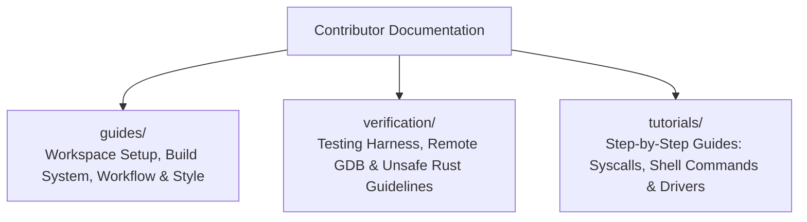

<!-- SPDX-License-Identifier: GPL-2.0-only -->

# Keira Kernel Contributor & Learning Guide

Welcome to the Keira Kernel development and contributor guide! Keira is an educational, freestanding, hyper-modular x86 operating system kernel written in safe Rust, Assembly, and C.

Whether you are a student exploring systems programming, a seasoned developer curious about bare-metal Rust, or a hobbyist building your own OS, you are warmly invited to learn, experiment, and contribute.

---

## Contributor Submodules

---

## Contributor Module Index

| Submodule | Focus Area | Description |
| :--- | :--- | :--- |
| [`guides/`](guides/README.md) | Development Guides | Toolchain setup, build matrix (`make full`), branch strategy, and style rules |
| [`verification/`](verification/README.md) | Verification & Debugging | Automated QEMU test suite, remote GDB debugging, and unsafe Rust safety contracts |
| [`tutorials/`](tutorials/README.md) | Developer Tutorials | Practical tutorials for implementing new syscalls, shell commands, and device drivers |

---

## Core Principles

1. **Hyper-Modular Separation**: Subsystems reside in their designated crate package with minimal public surface.
2. **Deterministic Safety**: All `unsafe` blocks must document a formal `# Safety` contract.
3. **Zero Userland Bloat**: Keep the userland footprint minimal, focused, and clean (`kcc.elf` compiler binary).
