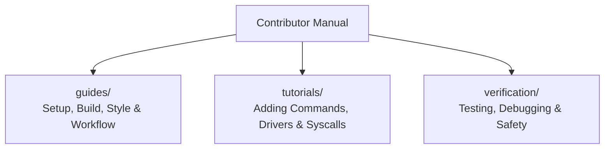

<!-- SPDX-License-Identifier: GPL-2.0-only -->

# Keira Contributor Guidelines & Developer Manual

Welcome to the Keira Kernel contributor guidelines. This directory contains essential manuals, architectural style guides, tutorials, and verification procedures for building and extending the kernel.

---

## Contributing Submodules

---

## Submodule Index

| Section | Focus Area | Description |
| :--- | :--- | :--- |
| [`guides/`](guides/README.md) | Development Guides | Setup, build system, coding style, and git workflow |
| [`tutorials/`](tutorials/README.md) | Step-by-Step Tutorials | Practical guides for adding new commands, drivers, and system calls |
| [`verification/`](verification/README.md) | Verification & Safety | Automated tests, QEMU debugging, and `# Safety` guidelines |
