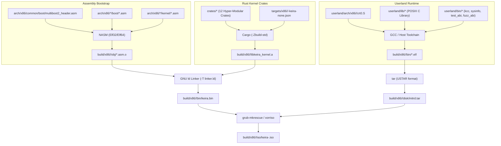

<!-- SPDX-License-Identifier: GPL-2.0-only -->

# Build System & Compilation Pipeline

Keira Kernel employs a unified, multi-stage compilation pipeline orchestrated by a non-recursive `Makefile`, building pure `#![no_std]` Rust kernel crates, low-level x86 assembly, userland C runtime libraries, and generating bootable ISOs and disk images.

---

## Complete Compilation Pipeline



---

## Multi-Architecture Compilation Matrix

Keira provides native support for both 64-bit Long Mode (`x86_64`) and 32-bit Protected Mode (`i686`):

| Architecture | Target Spec File | Default Build Command | Fast Run Target |
| :--- | :--- | :--- | :--- |
| **x86_64** (Default) | `targets/x86/x86_64/x86_64-keira-none.json` | `make` (or `make all`) | `make run` |
| **i686** (32-bit) | `targets/x86/i686/i686-keira-none.json` | `make ARCH=i686 all` | `make run-32` |
| **Dual Matrix** | Both architectures simultaneously | `make full` | `make test-all` |

---

## Cargo Target Specifications & Compiler Flags

Because Keira runs directly on bare metal without an underlying operating system, it uses custom JSON target specifications located in `targets/x86/`:

### Key Compiler Flags (`.cargo/config.toml` & Make invocations):
* `-Zjson-target-spec`: Enables loading of custom target definition files without requiring upstream Rust compiler target additions.
* `-Zbuild-std=core,compiler_builtins`: Compiles pure `core` and `compiler_builtins` from source for the target architecture.
* `-Zbuild-std-features=compiler-builtins-mem`: Enables optimized memory primitives (`memcpy`, `memset`, `memmove`) implemented directly in the core compiler intrinsics.
* `panic = "abort"`: Disables complex stack unwinding tables and landing pads, keeping binary footprints compact and deterministic.
* `lto = true`: Link-Time Optimization performs cross-crate dead code elimination and aggressive function inlining across all 12 kernel crates.

---

## Comprehensive Make Targets Inventory

The `Makefile` defines a complete developer interface for compilation, emulation, code formatting, static analysis, and verification:

| Make Target | Description | Preflight Guard |
| :--- | :--- | :--- |
| `make all` | Builds assembly, kernel binary, userland binaries, initrd, and bootable ISO for active `ARCH`. | `preflight` |
| `make full` | Symmetrically builds complete kernel releases, disk images, and ISOs for both `x86_64` and `i686`. | `preflight` |
| `make preflight` | Validates presence of core build utilities (`nasm`, `gcc`, `ld`, `cargo`, `rustc`, `grub-mkrescue`, `xorriso`, `mkfs.fat`, `mmd`, `mcopy`, `tar`, `dd`). Halts with copy-paste host commands on failure. | None |
| `make preflight-qemu` | Validates presence of QEMU hypervisor binaries for current target architecture. | None |
| `make preflight-format` | Validates formatting tools (`cargo fmt`, `clang-format`). | None |
| `make preflight-lint` | Validates static analysis tools (`clang-tidy`). | None |
| `make check` | Diagnostic checklist of all 15 build, emulation, formatting, and linting tools with copy-paste installation commands on missing items. | None |
| `make run` | Boots active architecture in QEMU with AHCI SATA, IDE, HDA sound, multi-core SMP (`-smp 2`), and serial redirection. | `preflight-qemu` |
| `make run-32` | Boots pure 32-bit `i686` kernel in QEMU. | `preflight-qemu` |
| `make run SMP=4` | Boots active architecture in QEMU with 4-core Symmetric Multiprocessing enabled. | `preflight-qemu` |
| `make test` | Executes automated headless QEMU smoke test for current architecture. | `preflight-qemu` |
| `make test-all` | Executes headless automated test harness across both `x86_64` and `i686` architectures sequentially. | `preflight-qemu` |
| `make format` | Formats all Rust crates (`cargo fmt`) and all userland C code (`clang-format`). | `preflight-format` |
| `make lint` | Runs `clang-tidy` across all userland C sources. | `preflight-lint` |
| `make clean` | Removes all build output directories (`build/`), compiled objects, disk images, and cargo build artifacts. | None |

---

## Build Output Hierarchy

Compilation artifacts are strictly isolated in `build/` by architecture:

```
build/
└── x86/
    ├── i686/
    │   ├── bin/               # keira.bin, kcc.elf, sysinfo.elf, test_abi.elf
    │   ├── disk/              # initrd.tar, fat32_disk.img, ext4_disk.img
    │   ├── iso/               # bootable keira-i686-<date>.iso
    │   └── obj/               # compiled *.asm.o object files
    └── x86_64/
        ├── bin/               # keira.bin, kcc.elf, sysinfo.elf, test_abi.elf
        ├── disk/              # initrd.tar, fat32_disk.img, ext4_disk.img
        ├── iso/               # bootable keira-x86_64-<date>.iso
        └── obj/               # compiled *.asm.o object files
```

---

## Host Environment Compatibility

The build system includes automatic environment detection:
* **GRUB Detection**: Automatically detects `grub-mkrescue` (Arch Linux, Debian/Ubuntu) or `grub2-mkrescue` (Fedora, openSUSE).
* **Deterministic Shell**: Explicit `SHELL := /bin/bash` guarantees POSIX parameter expansion and error propagation regardless of `/bin/sh` symlink target.
* **Portable Escapes**: `printf` calls avoid non-portable hex sequences (`\x02`) in favor of standard octal escapes (`\002`).
