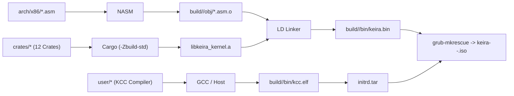

<!-- SPDX-License-Identifier: GPL-2.0-only -->

# Build System & Cargo Configuration

Keira Kernel utilizes a pure Rust kernel build pipeline with assembly bootstrap orchestrated by `make`.

---

## Pipeline Overview

---

## Multi-Architecture Compilation Matrix

| Architecture | Target Spec | Build Command | QEMU Command |
| :--- | :--- | :--- | :--- |
| **x86_64** (Default) | `targets/x86/x86_64-keira-none.json` | `make` (or `make all`) | `make run` |
| **i686** (32-bit) | `targets/x86/i686-keira-none.json` | `make ARCH=i686 all` | `make run-32` |
| **Dual Matrix** | Both architectures | `make full` | `make test-all` |

---

## Common Make Targets

* `make all`: Compiles assembly, 12 Rust kernel crates, userland KCC, initrd, and bootable ISO for active `ARCH`.
* `make full`: Compiles kernel binaries, ISOs, and disk images for both `x86_64` and `i686`.
* `make run`: Boots active `ARCH` in QEMU with AHCI SATA, IDE, HDA sound, and COM1 serial output.
* `make run-32`: Boots pure 32-bit `i686` kernel in QEMU.
* `make test-all`: Runs headless automated test harness across all target architectures.
* `make format`: Automatically formats Rust code (`cargo fmt`) and C code (`clang-format`).
* `make clean`: Removes all build output directories and intermediate object files.
