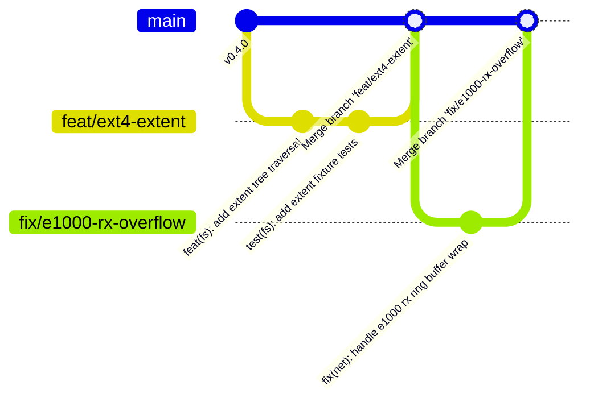

<!-- SPDX-License-Identifier: GPL-2.0-only -->

# Git Workflow & Collaboration Guidelines

This document outlines the branch management, contribution workflow, automated quality checks, and commit structuring rules for Keira Kernel.

---

## Branching Strategy



* **`main`**: The protected mainline development branch. Must always compile cleanly (`0` errors, `0` warnings) across both `x86_64` and `i686` targets.
* **Feature Branches**: `feat/<scope>-<short-description>` (e.g., `feat/fs-ext4-extents`, `feat/net-tls-cipher`).
* **Fix Branches**: `fix/<scope>-<issue-description>` (e.g., `fix/apic-timer-overflow`, `fix/syscall-write-bounds`).

---

## Developer Quality Gate Checklist

Before proposing or committing changes, execute the full local validation sequence:

```bash
# 1. Format code across Rust and C trees
make format

# 2. Run static analysis on userland C
make lint

# 3. Compile kernel binaries and bootable images for both architectures
make full

# 4. Run automated headless test suite across both architectures
make test-all
```

---

## Atomic & Granular Commits

Keira adheres to a strict **atomic commit invariant**:
* Do **NOT** combine unrelated changes across different subsystems into a single commit.
* Separate documentation updates, kernel core fixes, driver changes, and userland code into distinct commits.
* Ensure every commit compiles independently so `git bisect` remains effective for regression testing.
