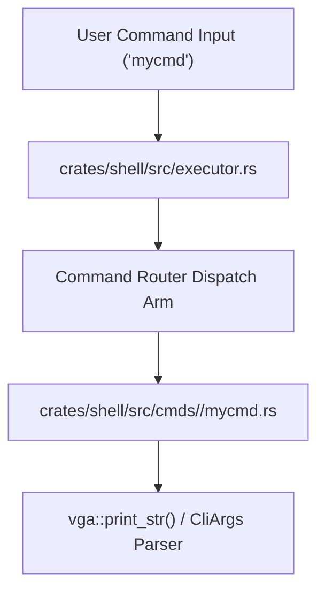

<!-- SPDX-License-Identifier: GPL-2.0-only -->

# Tutorial: Creating a Native Shell Command

This guide provides a step-by-step walkthrough for adding a new native built-in command to `keira-shell`.

---

## Command Registration Architecture



---

## Step-by-Step Implementation

### Step 1: Create Command Source File
Select the appropriate category subfolder in `crates/shell/src/cmds/` (`fs`, `sys`, `proc`, `net`, `sec`, `dev`, or `util`), and create [`crates/shell/src/cmds/<category>/mycmd.rs`](../../../crates/shell/src/cmds):
```rust
// SPDX-License-Identifier: GPL-2.0-only
//
// Keira Kernel - Operating System Kernel
// Copyright (C) 2026 Moh. Ananda Firmansyah Putra
//
// This program is free software; you can redistribute it and/or modify
// it under the terms of the GNU General Public License as published by
// the Free Software Foundation; version 2 of the License.

use crate::args::CliArgs;
use keira_io::vga;

pub fn run(parts: &mut core::str::SplitWhitespace) {
    let args = CliArgs::parse(parts);
    if args.has_flag('h', "help") {
        unsafe {
            vga::print_str("Usage: mycmd [options]\n");
        }
        return;
    }
    unsafe {
        vga::print_str("Hello from mycmd!\n");
    }
}
```

### Step 2: Register in Category Module & Executor
1. Add `pub mod mycmd;` to `crates/shell/src/cmds/<category>/mod.rs`.
2. Add `"mycmd" => super::cmds::<category>::mycmd::run(&mut parts),` inside `crates/shell/src/executor.rs`.
3. Add `mycmd` to the `SHELL_CMDS` list in [`Makefile`](../../../Makefile).
