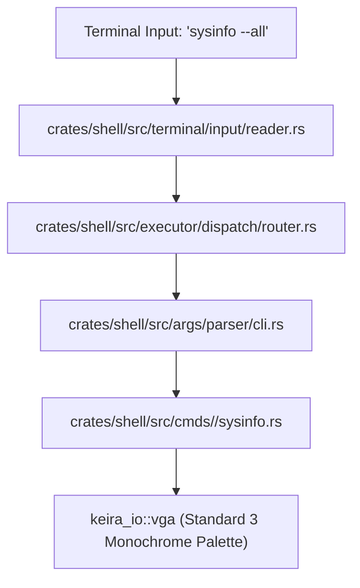

<!-- SPDX-License-Identifier: GPL-2.0-only -->

# Tutorial: Creating a Native Built-in Shell Command

This tutorial provides a complete walkthrough for implementing, parsing flags, styling output, registering, and testing a new built-in command in `keira-shell`.

---

## 1. Shell Command Architecture

Commands in Keira execute directly in kernel context within the shell subsystem without spawning external processes:



---

## 2. Choosing Category & Creating Source File

Native commands are organized into 7 functional categories inside `crates/shell/src/cmds/`:
* `sys/`: System diagnostics, hardware telemetry, APIC, time, reboot.
* `fs/`: Filesystem navigation, directory listing, file inspection, disk operations.
* `proc/`: Task scheduling, cgroups, process trees, execution.
* `net/`: Network interface management, ARP, ping, DNS, HTTP/HTTPS client.
* `dev/`: Hardware device queries, PCI scanning, ATA/AHCI, virtio.
* `sec/`: Seccomp sandbox policies, TPM measurements, permissions.
* `util/`: String manipulation, checksums, editor, calculators.

Create `crates/shell/src/cmds/<category>/<cmd_name>.rs`:

```rust
// SPDX-License-Identifier: GPL-2.0-only
//
// Keira Kernel - Freestanding Kernel from Scratch
// Copyright (C) 2026 Moh. Ananda Firmansyah Putra
//
// This program is free software; you can redistribute it and/or modify
// it under the terms of the GNU General Public License as published by
// the Free Software Foundation; version 2 of the License.

use crate::args::parser::cli::CliArgs;
use keira_io::vga;

/// Executes the 'banner' command.
pub fn run(parts: &mut core::str::SplitWhitespace) {
    let args = CliArgs::parse(parts);

    // 1. Handle help flag (-h, --help)
    if args.has_flag('h', "help") {
        vga::set_color(vga::Color::White, vga::Color::Black);
        vga::print_str("Usage: banner [options] <message>\n\n");
        vga::set_color(vga::Color::LightGrey, vga::Color::Black);
        vga::print_str("Options:\n");
        vga::print_str("  -u, --uppercase    Convert banner text to uppercase\n");
        vga::print_str("  -h, --help         Display this help message\n");
        return;
    }

    // 2. Query positional parameters
    let message = match args.positional(0) {
        Some(msg) => msg,
        None => {
            vga::set_color(vga::Color::LightRed, vga::Color::Black);
            vga::print_str("Error: missing required <message> argument\n");
            vga::set_color(vga::Color::LightGrey, vga::Color::Black);
            return;
        }
    };

    let uppercase = args.has_flag('u', "uppercase");

    // 3. Print output using the 3 Monochrome Linux Console Palette
    vga::set_color(vga::Color::White, vga::Color::Black);
    vga::print_str("--- [ Keira Banner ] ---\n");

    vga::set_color(vga::Color::LightGreen, vga::Color::Black);
    vga::print_str("[OK] ");

    vga::set_color(vga::Color::LightGrey, vga::Color::Black);
    if uppercase {
        for b in message.bytes() {
            let c = (b as char).to_ascii_uppercase();
            let mut buf = [0u8; 4];
            vga::print_str(c.encode_utf8(&mut buf));
        }
    } else {
        vga::print_str(message);
    }
    vga::print_str("\n");
}
```

---

## 3. Registering the Command

1. **Expose in Category Module**:
   Add to `crates/shell/src/cmds/<category>/mod.rs`:
   ```rust
   pub mod banner;
   ```

2. **Add to Dispatch Router**:
   In `crates/shell/src/executor/dispatch/router.rs`, add the match arm:
   ```rust
   "banner" => super::super::cmds::util::banner::run(&mut parts),
   ```

3. **Register in Command Table**:
   In `crates/shell/src/cmds/table/registry.rs`, add command metadata for shell `help` and tab autocomplete:
   ```rust
   CommandMeta {
       name: "banner",
       category: Category::Util,
       summary: "Prints formatted banner messages to console",
   },
   ```

---

## 4. Verification in QEMU

Rebuild and test interactively:
```bash
make run
```
At the shell prompt:
```bash
admin@keira:~$ banner --help
admin@keira:~$ banner -u "welcome to keira"
```
