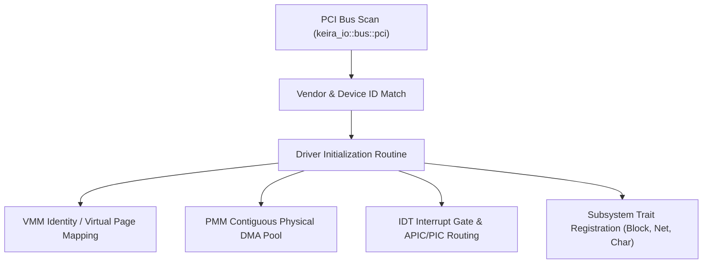

<!-- SPDX-License-Identifier: GPL-2.0-only -->

# Tutorial: Developing Hardware Device Drivers

This tutorial guides developers through writing, initializing, and registering hardware device drivers in Keira Kernel, covering PCI bus discovery, Memory-Mapped I/O (MMIO), DMA allocation, and interrupt routing.

---

## 1. Hardware Abstraction Layers

Keira structures drivers into specialized crates and abstraction layers:



---

## 2. Step 1: PCI Device Probing

PCI devices report standard configuration headers. Identify your hardware:
* **Vendor ID**: 16-bit identifier (e.g. `0x8086` for Intel, `0x10EC` for Realtek).
* **Device ID**: 16-bit hardware identifier.
* **Base Address Registers (BARs)**: Indicate port I/O ranges or physical MMIO addresses.

In `crates/io/src/bus/pci/scan.rs`:
```rust
for dev in pci::scan_bus() {
    if dev.vendor_id == 0x8086 && dev.device_id == 0x100E {
        // Intel 82540EM Gigabit Ethernet NIC detected
        e1000::init(dev);
    }
}
```

---

## 3. Step 2: Mapping MMIO & Allocating DMA

Device registers are mapped into kernel virtual address space:

```rust
use keira_mem::vmm::paging::map_mmio_range;
use keira_mem::dma::alloc_contiguous_dma;

pub struct MyDriver {
    mmio_base: usize,
    dma_buffer: usize,
    dma_phys: usize,
}

impl MyDriver {
    pub fn new(bar0_phys: usize, bar0_size: usize) -> Result<Self, &'static str> {
        // 1. Map physical MMIO pages with Cache-Disable flags
        let mmio_virt = map_mmio_range(bar0_phys, bar0_size)?;

        // 2. Allocate physically contiguous 32-bit DMA ring buffers
        let (dma_virt, dma_phys) = alloc_contiguous_dma(8192)?;

        Ok(Self {
            mmio_base: mmio_virt,
            dma_buffer: dma_virt,
            dma_phys,
        })
    }
}
```

---

## 4. Step 3: Registering with Subsystem

If writing a block storage driver (e.g. NVMe, AHCI, Ramdisk), implement `BlockDevice`:

```rust
use keira_io::storage::block::{BlockDevice, register_block_device};

impl BlockDevice for MyDriver {
    fn read_sector(&mut self, lba: u64, buf: &mut [u8; 512]) -> Result<(), &'static str> {
        // Device-specific DMA command dispatch
        Ok(())
    }

    fn write_sector(&mut self, lba: u64, buf: &[u8; 512]) -> Result<(), &'static str> {
        Ok(())
    }
}
```

Register the driver instance:
```rust
register_block_device("hd0", Box::new(driver));
```
