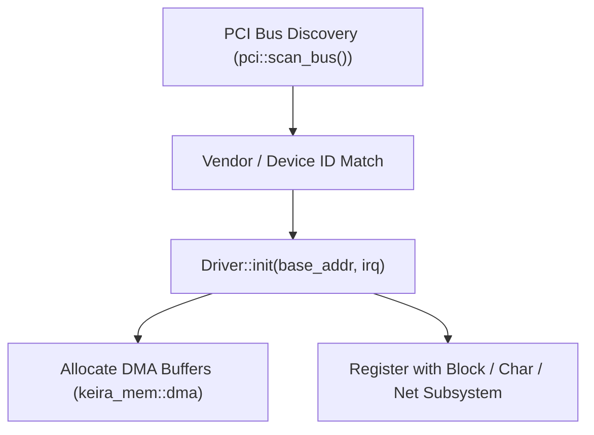

<!-- SPDX-License-Identifier: GPL-2.0-only -->

# Tutorial: Developing Hardware Drivers

This guide provides a step-by-step walkthrough for developing and registering hardware device drivers in Keira Kernel.

---

## Device Driver Registration Pipeline

---

## Step-by-Step Implementation

### Step 1: Identify PCI Device Identifiers
Locate the PCI Vendor ID, Device ID, Class Code, and Subclass for your hardware target.

### Step 2: Implement Driver Module
Create a new driver under `crates/io/src/storage/`, `crates/io/src/sound/`, `crates/io/src/net/`, or `crates/io/src/bus/`:
* Setup MMIO register bases and port I/O mapping.
* Allocate physically contiguous DMA buffers via `keira_mem::dma::alloc_dma_buffer()`.
* Register the hardware interrupt vector with the IDT and PIC/APIC.

### Step 3: Register with Subsystem
If implementing a block storage device, implement the `BlockDevice` trait and register it via `keira_io::storage::block::register_device()`.
