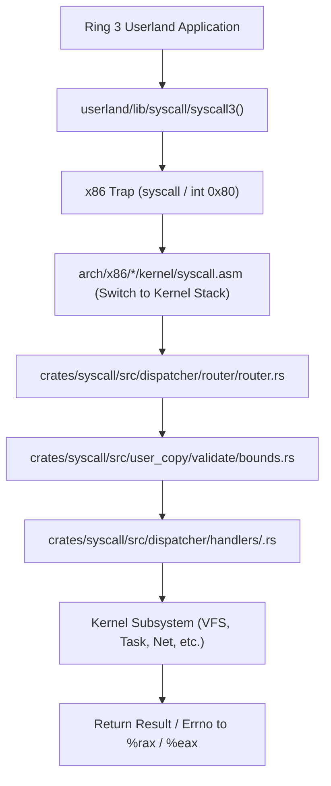

<!-- SPDX-License-Identifier: GPL-2.0-only -->

# Tutorial: Adding System Calls

This guide provides a comprehensive, end-to-end tutorial for defining, implementing, securing, and testing a new system call across both `x86_64` (Long Mode) and `i686` (Protected Mode) architectures.

---

## 1. System Call Architecture & ABI

Keira provides dual-architecture system call trapping:
* **`i686`**: Software interrupt `int 0x80`. Registers: `%eax` (Syscall number), `%ebx` (Arg 1), `%ecx` (Arg 2), `%edx` (Arg 3), `%esi` (Arg 4), `%edi` (Arg 5).
* **`x86_64`**: Fast `syscall` instruction. Registers: `%rax` (Syscall number), `%rdi` (Arg 1), `%rsi` (Arg 2), `%rdx` (Arg 3), `%r10` (Arg 4), `%r8` (Arg 5), `%r9` (Arg 6).



---

## 2. Step 1: Assign Syscall Vector Number

In `crates/syscall/src/table/numbers/constants.rs`, add a new unique constant:

```rust
pub const SYS_GETUPTIME: usize = 120;
```

---

## 3. Step 2: Implement Kernel Handler

Create or update the handler in `crates/syscall/src/dispatcher/handlers/time.rs`:

```rust
// SPDX-License-Identifier: GPL-2.0-only
//
// Keira Kernel - Freestanding Kernel from Scratch
// Copyright (C) 2026 Moh. Ananda Firmansyah Putra
//
// This program is free software; you can redistribute it and/or modify
// it under the terms of the GNU General Public License as published by
// the Free Software Foundation; version 2 of the License.

use crate::user_copy::validate::bounds::validate_user_ptr;
use crate::user_copy::copy::to_user::copy_to_user;
use crate::user_copy::errno::codes::*;
use keira_kernel::time::uptime;

/// Handler for SYS_GETUPTIME (syscall 120).
/// Writes monotonic system uptime in milliseconds to user buffer.
pub fn sys_getuptime(user_buf_ptr: usize, len: usize) -> isize {
    // 1. Defensive parameter verification
    if len < core::mem::size_of::<u64>() {
        return -EINVAL;
    }

    // 2. Validate user pointer boundary (must not overlap kernel memory)
    if !validate_user_ptr(user_buf_ptr, core::mem::size_of::<u64>(), true) {
        return -EFAULT;
    }

    let current_uptime_ms = uptime::get_monotonic_ms();

    // 3. Copy safely to user memory
    match copy_to_user(user_buf_ptr, &current_uptime_ms.to_ne_bytes()) {
        Ok(_) => 0, // Success
        Err(_) => -EFAULT,
    }
}
```

---

## 4. Step 3: Wire into Dispatcher Router

Add the match arm to `crates/syscall/src/dispatcher/router/router.rs`:

```rust
SYS_GETUPTIME => {
    handlers::time::sys_getuptime(arg1 as usize, arg2 as usize)
}
```

---

## 5. Step 4: Expose in Userland C Headers & Libc

1. **Add to C Header (`userland/include/sys/syscall.h`)**:
   ```c
   #define SYS_getuptime 120

   int getuptime(uint64_t *uptime_ms);
   ```

2. **Add Libc Wrapper (`userland/lib/time/uptime.c`)**:
   ```c
   /* SPDX-License-Identifier: GPL-2.0-only */
   #include <sys/syscall.h>
   #include <stdint.h>
   #include <errno.h>

   int getuptime(uint64_t *uptime_ms) {
       long ret = syscall2(SYS_getuptime, (long)uptime_ms, sizeof(uint64_t));
       if (ret < 0) {
           errno = -ret;
           return -1;
       }
       return 0;
   }
   ```

---

## 6. Step 5: Test and Fuzz

* Add test case to `userland/bin/test_abi/main.c`:
  ```c
  uint64_t ms = 0;
  assert(getuptime(&ms) == 0);
  assert(ms > 0);
  ```
* Run `fuzz_abi.elf` to ensure passing `NULL`, `(void*)0xC0000000`, or `len = 1` safely returns `-EFAULT` or `-EINVAL` without triggering a kernel panic.
