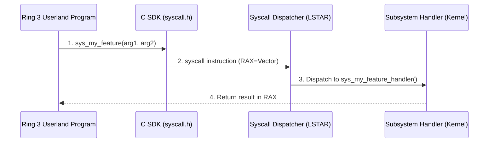

<!-- SPDX-License-Identifier: GPL-2.0-only -->

# Tutorial: Implementing a New System Call

This guide provides a step-by-step walkthrough for implementing, registering, and exposing a new kernel system call in Keira Kernel.

---

## System Call Implementation Flow



---

## Step-by-Step Implementation

### Step 1: Assign Vector Number
Define the new syscall constant in [`crates/syscall/src/table/mod.rs`](../../../crates/syscall/src/table/mod.rs):
```rust
pub const SYS_MY_FEATURE: u64 = 75;
```

### Step 2: Implement Handler
Implement the core logic inside the appropriate subsystem crate (e.g. `crates/task/src/` or `crates/io/src/`).

### Step 3: Wire into Dispatcher
Add the dispatch arm inside `syscall_dispatcher` in [`crates/syscall/src/dispatcher/mod.rs`](../../../crates/syscall/src/dispatcher/mod.rs):
```rust
SYS_MY_FEATURE => sys_my_feature_handler(arg1, arg2),
```

### Step 4: Expose in Userland C SDK
Add the C declaration to `user/include/syscall.h`:
```c
int sys_my_feature(int arg1, int arg2);
```
