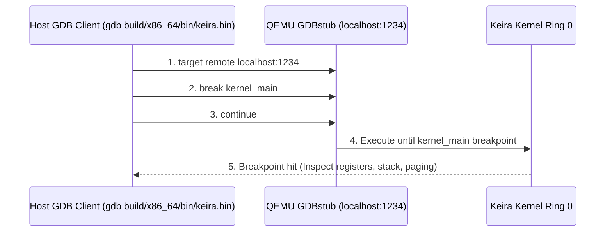

<!-- SPDX-License-Identifier: GPL-2.0-only -->

# Kernel Debugging with GDB, Serial & QEMU Monitor

This document details remote GDB debugging, serial UART logging, register inspection, and QEMU monitor interaction in Keira Kernel.

---

## Remote GDB Debugging Architecture



---

## 1. Remote GDB Debugging Workflow

Launch Keira in QEMU debug mode (freezes CPU execution at Multiboot2 entry and waits for GDB on TCP port `1234`):
```bash
make debug
```

In a separate terminal, launch GDB and connect:
```bash
gdb build/x86_64/bin/keira.bin
(gdb) target remote localhost:1234
(gdb) break kernel_main
(gdb) continue
```

### Useful GDB Commands for Bare-Metal Kernel:
* `info registers`: Dump all general-purpose CPU registers (`RAX` through `R15`, `RIP`, `RFLAGS`).
* `x/16gx $rsp`: Inspect top 16 64-bit quadwords on the stack.
* `x/8i $rip`: Disassemble the next 8 instructions at the current program counter.
* `p/x $cr3`: Read the root page table physical base address.

---

## 2. COM1 Serial Tracing & Automated Telemetry

All early boot milestone messages and kernel panic dumps are output directly to COM1 serial (`-serial stdio`). To redirect serial output directly to a log file:
```bash
qemu-system-x86_64 -cdrom build/x86_64/iso/keira-x86_64-*.iso -serial file:serial.log -display none
```

---

## 3. QEMU Interactive Monitor

Access the interactive QEMU monitor console by pressing `Ctrl+Alt+2` in graphical mode, or run:
```bash
info registers
info mem
info pci
```
