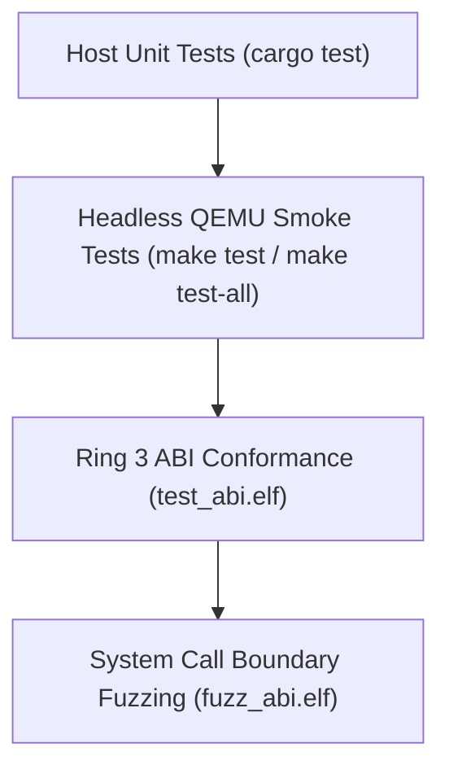

<!-- SPDX-License-Identifier: GPL-2.0-only -->

# Automated Testing & Verification Suite

Keira employs a multi-tiered testing strategy encompassing unit tests, automated QEMU smoke tests, Ring 3 ABI verification, and differential system call fuzzing.

---

## 1. Testing Pyramid



---

## 2. Automated QEMU Test Harness

Execute headless tests verifying kernel boot, shell initialization, command execution, and clean shutdown:

```bash
# Run test suite for current architecture
make test

# Run test suite across both x86_64 and i686 architectures
make test-all
```

The test runner:
1. Boots kernel in QEMU with `-display none -serial stdio`.
2. Interacts with the serial console, executing verification commands (`sysinfo`, `fs list`, `net info`).
3. Evaluates command outputs against expected tokens.
4. Asserts exit code `0` on 100% test pass.

---

## 3. Ring 3 ABI Conformance Testing

The `test_abi.elf` binary exercises system calls from user mode:
* `fork()`, `execve()`, `waitpid()` process lifecycle validation.
* POSIX file I/O operations (`open`, `read`, `write`, `lseek`, `close`).
* Virtual memory boundary allocation (`mmap`, `munmap`).
* Signal delivery, masking, and default disposition.

---

## 4. System Call Fuzz Testing

The `fuzz_abi.elf` binary runs continuous stress tests against syscall entry points:
* Verifies `validate_user_ptr` catches invalid kernel addresses (`0xC0000000+`).
* Verifies zero-length buffers, negative counts, and misaligned pointers return `-EFAULT` or `-EINVAL` without panicking the kernel.
