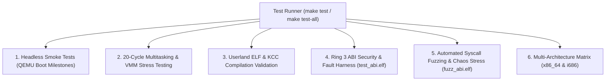

<!-- SPDX-License-Identifier: GPL-2.0-only -->

# Automated Testing & Verification Suite

This document details the multi-tiered automated quality assurance, smoke testing, and regression suites in Keira Kernel.

---

## Testing Matrix Hierarchy



---

## 1. Headless Smoke Testing (`make test`)

Executes automated boot validation in headless QEMU mode without requiring a graphical window:
```bash
# Test active architecture (default x86_64)
make test

# Test both x86_64 and i686 architectures
make test-all
```

---

## 2. QMP Automated Script Testing

The QEMU Machine Protocol (QMP) interface allows external test harnesses to send keystrokes, execute shell commands, and capture high-resolution framebuffer screendumps (`screendump`):
```bash
# Launch test harness
python3 -c "import subprocess; subprocess.run(['make', 'all'])"
```

---

## 3. 20-Cycle Kernel Stress Testing

The 20-cycle automated stress test verifies that repeated execution of kernel commands, userland Ring 3 ELF compilations (`run /apps/bin/kcc.elf`), and VMM address space cloning does not leak physical memory or trigger kernel panics.

---

## 4. Ring 3 Syscall Security & Fault Harness (`test_abi.elf`)

The ABI verification suite exercises 42 distinct security, memory isolation, process orchestration, signal delivery, file descriptor management, asynchronous I/O, and fault-containment tests across both `x86_64` and `i686`:

```bash
run /system/bin/test_abi.elf
```

Key verification domains:
* **Memory Safety & Kernel Boundary**: Validates that NULL pointers, higher-half kernel virtual addresses, and unmapped ranges are rejected with `EFAULT` without triggering kernel page faults.
* **Multiprocess Orchestration**: Verifies `fork`, `waitpid`, process tree hierarchy, orphan reparenting to PID 0, and Copy-On-Write (COW) memory isolation.
* **POSIX Signals & Restorers**: Tests `sigaction`, `sigreturn`, `sigprocmask`, and `sigpending` delivery integrity.
* **Hardware Exception Containment**: Traps `#UD` (SIGILL), `#DE` (SIGFPE), and `#PF` (SIGSEGV) safely in child processes with automated persistent core dump generation (`/data/log/core_<PID>.dmp`).
* **VMM Demand Paging & msync**: Confirms lazy allocation via `#PF` and disk persistence synchronization.
* **Asynchronous I/O Engine**: Exercises bare-metal `io_uring` submission queue (SQ) and completion queue (CQ) processing for `IORING_OP_NOP` and `IORING_OP_FSYNC`.
* **High-Precision Monotonic Clock**: Validates sub-nanosecond monotonic timing and delta consistency via `clock_gettime(CLOCK_MONOTONIC)` and `clock_gettime_fast`.

---

## 5. Ring 3 Automated Syscall Fuzzing & Chaos Stress (`fuzz_abi.elf`)

The automated fuzzing framework subjects the kernel to extreme boundary inputs and multi-phase resource exhaustion directly from unprivileged Ring 3:

```bash
run /system/bin/fuzz_abi.elf
```

Execution phases:
* **Phase 1: Syzkaller-Lite Mutation**: 10,000 rapid iterations testing system calls (vectors 1..85) against boundary value pools (NULL, high kernel canonical addresses, misaligned offsets, and integer extremes).
* **Phase 2: Chaos File Descriptor Exhaustion**: Satures 256 open file handles to verify `EMFILE` limits and descriptor auto-reclamation.
* **Phase 3: Chaos Virtual Memory Saturation**: Tests upper heap boundaries (`sbrk`) for safe `ENOMEM` rejection and stress-tests dynamic `mmap`/`munmap` cycles.
* **Phase 4: Chaos Burst Fork Churn**: Executes 16 rapid fork-and-exit cycles to stress PID recycling and zombie slot recovery.
* **Phase 5: Chaos Signal Storm**: Emits high-frequency signal bursts to certify signal queue robustness and mask restoration.
