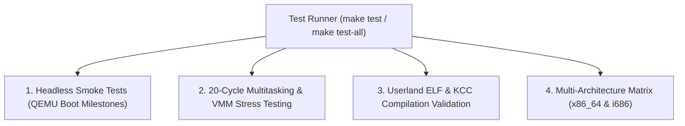

<!-- SPDX-License-Identifier: GPL-2.0-only -->

# Automated Testing & Verification Suite

This document details the multi-tiered automated quality assurance, smoke testing, and regression suites in Keira Kernel.

---

## Testing Matrix Hierarchy



---

## 1. Headless Smoke Testing (`make test`)

Executes automated boot validation in headless QEMU mode without requiring a graphical window:
```bash
# Test active architecture (default x86_64)
make test

# Test both x86_64 and i686 architectures
make test-all
```

---

## 2. QMP Automated Script Testing

The QEMU Machine Protocol (QMP) interface allows external test harnesses to send keystrokes, execute shell commands, and capture high-resolution framebuffer screendumps (`screendump`):
```bash
# Launch test harness
python3 -c "import subprocess; subprocess.run(['make', 'all'])"
```

---

## 3. 20-Cycle Kernel Stress Testing

The 20-cycle automated stress test verifies that repeated execution of kernel commands, userland Ring 3 ELF compilations (`run /apps/bin/kcc.elf`), and VMM address space cloning does not leak physical memory or trigger kernel panics.
