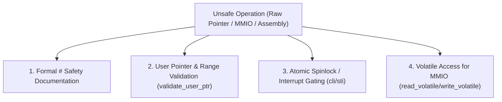

<!-- SPDX-License-Identifier: GPL-2.0-only -->

# Unsafe Rust Safety Contracts & Invariants

This document establishes the memory safety guidelines, invariants, and documentation requirements for `unsafe` Rust code in Keira Kernel.

---

## Unsafe Rust Contract Hierarchy



---

## Core Safety Rules

### 1. Document Formal `# Safety` Contracts
Every `unsafe fn` declaration and standalone `unsafe` block **MUST** explain why the caller or internal hardware invariant guarantees memory safety:
```rust
/// Reads a 32-bit register from a memory-mapped I/O address.
///
/// # Safety
/// The caller must ensure that `reg_addr` points to a valid, mapped MMIO register
/// and that concurrent writes do not cause hardware race conditions.
pub unsafe fn mmio_read32(reg_addr: usize) -> u32 {
    core::ptr::read_volatile(reg_addr as *const u32)
}
```

### 2. Userland Pointer Validation
Never dereference raw pointers provided by Ring 3 userland without explicitly verifying address bounds:
* Reject null pointers (`ptr == 0`).
* Reject kernel space addresses (must reside strictly below userland limit `0x0000_7FFF_FFFF_FFFF`).
* Guard against arithmetic overflow on pointer offsets.

### 3. Critical Section Interrupt Gating (`cli` / `sti`)
When modifying shared kernel data structures from interrupt handlers or scheduler paths, disable CPU interrupts to prevent deadlock re-entrancy.

### 4. Volatile Memory-Mapped I/O Access
Always use `core::ptr::read_volatile` and `core::ptr::write_volatile` when accessing memory-mapped I/O device registers (e.g. APIC, HPET, AHCI, NVMe doorbells) to prevent compiler optimizations from eliminating essential hardware side-effects.
