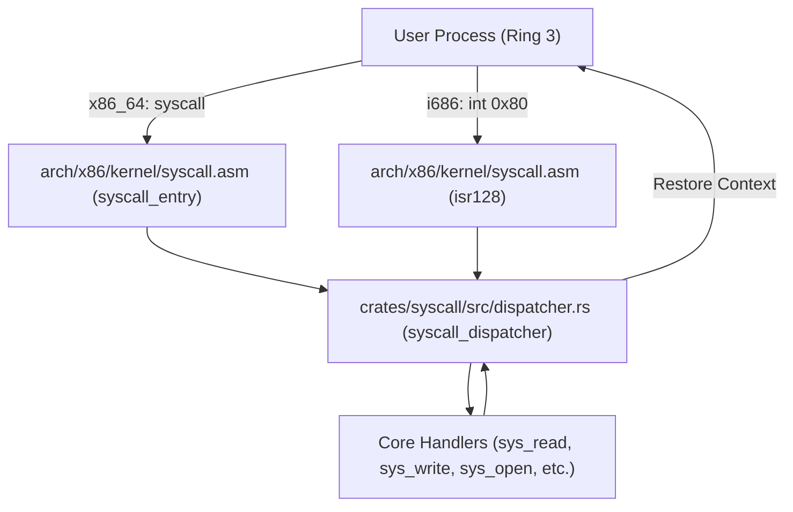

<!-- SPDX-License-Identifier: GPL-2.0-only -->

# System Call Dispatcher & Entry ABI

Central system call dispatcher implemented in [`crates/syscall/src/dispatcher.rs`](../../../crates/syscall/src/dispatcher.rs). Keira supports dual-architecture syscall invocation across both 64-bit and 32-bit CPU modes.

---

## 1. Register Calling Conventions

### A. 64-bit Long Mode (`x86_64` - Native `syscall` / LSTAR):
- **Syscall Number**: `RAX`
- **Argument 1**: `RDI`
- **Argument 2**: `RSI`
- **Argument 3**: `RDX`
- **Argument 4**: `R10` (transferred from `RCX` due to `syscall` instruction)
- **Argument 5**: `R8`
- **Argument 6**: `R9`
- **Return Value**: `RAX` (Negative values indicate standard POSIX errno)

### B. 32-bit Protected Mode (`i686` - Interrupt Vector 128 / `int $0x80`):
- **Syscall Number**: `EAX`
- **Argument 1**: `EBX`
- **Argument 2**: `ECX`
- **Argument 3**: `EDX`
- **Argument 4**: `ESI`
- **Argument 5**: `EDI`
- **Argument 6**: `EBP`
- **Return Value**: `EAX` (low 32-bit return status)

---

## 2. Dispatch Flow

