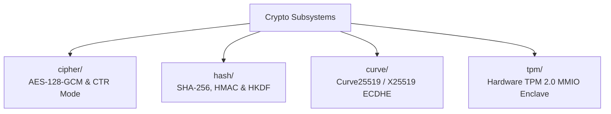

<!-- SPDX-License-Identifier: GPL-2.0-only -->

# Keira Cryptography Subsystem Architecture

The `crypto` domain provides bare-metal cryptographic algorithms and hardware security module drivers.

---

## Cryptography Submodules

---

## Submodule Index

| Submodule | Focus Area | Description |
| :--- | :--- | :--- |
| [`cipher/`](cipher/README.md) | Symmetric Ciphers | AES-128 block cipher and Galois/Counter Mode (GCM) |
| [`hash/`](hash/README.md) | Hash Functions | SHA-256 digest, HMAC message auth, HKDF expansion |
| [`curve/`](curve/README.md) | Elliptic Curves | X25519 scalar multiplication and ECDHE key exchange |
| [`tpm/`](tpm/README.md) | Hardware Enclave | TPM 2.0 TIS MMIO communication, PCR measurement |
