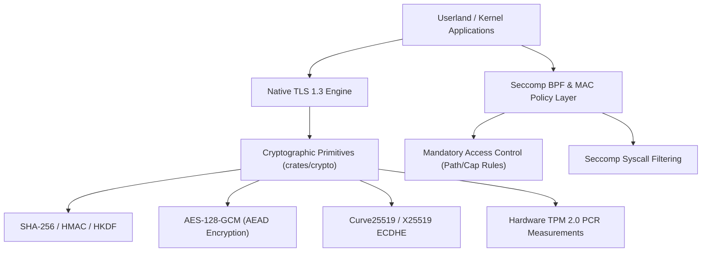

<!-- SPDX-License-Identifier: GPL-2.0-only -->

# Keira Kernel Cryptographic & Security Subsystems

The `crypto` subsystem provides bare-metal cryptographic primitives, hardware TPM 2.0 enclave communication, Seccomp BPF system call filters, and Mandatory Access Control (MAC) policies in Keira Kernel.

---

## Cryptography & Security Subsystem Architecture

---

## Cryptography & Security Module Index

| Component | Document | Description | Implementation |
| :--- | :--- | :--- | :--- |
| **SHA-256 & HMAC** | [`sha256.md`](sha256.md) | Pure Rust SHA-256 hash engine, HMAC, and HKDF key derivation | `crates/crypto/src/sha256/` |
| **AES & AES-GCM** | [`aes.md`](aes.md) | AES-128 block cipher and Galois/Counter Mode (GCM) AEAD encryption | `crates/crypto/src/aes/` |
| **Curve25519** | [`curve25519.md`](curve25519.md) | X25519 Elliptic Curve Diffie-Hellman (ECDHE) key exchange | `crates/crypto/src/curve25519/` |
| **TPM 2.0 Enclave** | [`tpm.md`](tpm.md) | Hardware Trusted Platform Module 2.0 commands and PCR extension | `crates/crypto/src/tpm/` |
| **Seccomp BPF** | [`seccomp.md`](seccomp.md) | Task-level BPF system call validation and sandboxing engine | `crates/crypto/src/seccomp/` |
| **MAC Security** | [`mac.md`](mac.md) | Mandatory Access Control inode path security and capabilities | `crates/crypto/src/mac/` |
