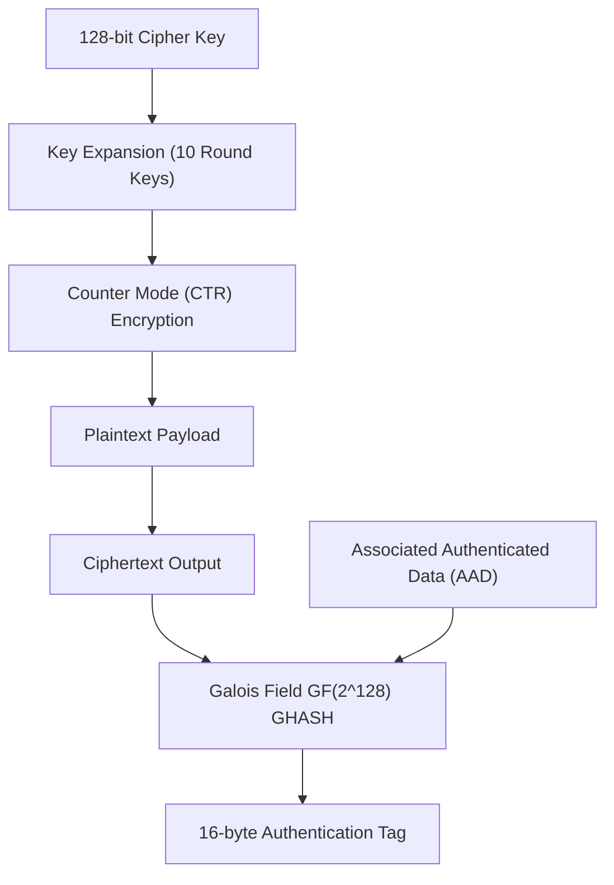

<!-- SPDX-License-Identifier: GPL-2.0-only -->

# Advanced Encryption Standard (AES-128-GCM)

This document specifies the Advanced Encryption Standard (AES) block cipher and Galois/Counter Mode (GCM) Authenticated Encryption with Associated Data (AEAD) in Keira Kernel.

---

## AES-128-GCM Cryptographic Pipeline



---

## Technical Specifications

| Parameter | Specification | Description |
| :--- | :--- | :--- |
| **Cipher Key Length** | 128 bits (16 bytes) | Standard AES-128 key space |
| **Rounds** | 10 Rounds | SubBytes, ShiftRows, MixColumns, AddRoundKey |
| **AEAD Mode** | Galois/Counter Mode (GCM) | Combined confidentiality and integrity validation |
| **Nonce / IV** | 96 bits (12 bytes) | Unique initialization vector per record |
| **Authentication Tag** | 128 bits (16 bytes) | GHASH authentication tag |

---

## Core API (`crates/crypto/src/aes/mod.rs`)

```rust
/// Encrypt plaintext using AES-128-GCM AEAD mode.
pub fn aes_128_gcm_encrypt(
    key: &[u8; 16],
    nonce: &[u8; 12],
    aad: &[u8],
    plaintext: &[u8],
    ciphertext: &mut [u8],
    tag: &mut [u8; 16],
) -> Result<(), &'static str>;

/// Decrypt ciphertext and verify 16-byte GHASH tag using AES-128-GCM.
pub fn aes_128_gcm_decrypt(
    key: &[u8; 16],
    nonce: &[u8; 12],
    aad: &[u8],
    ciphertext: &[u8],
    tag: &[u8; 16],
    plaintext: &mut [u8],
) -> Result<(), &'static str>;
```
