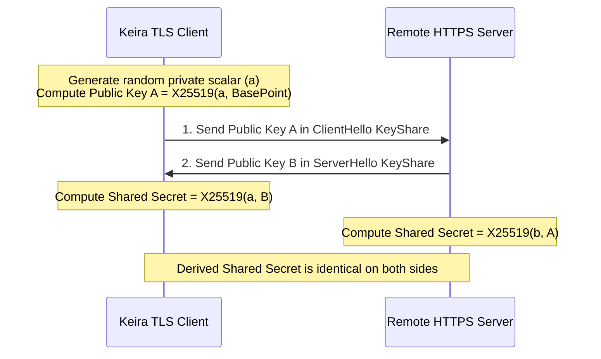

<!-- SPDX-License-Identifier: GPL-2.0-only -->

# Curve25519 & X25519 ECDHE Key Agreement

This document details Montgomery curve scalar multiplication on Curve25519 used for Ephemeral Diffie-Hellman (ECDHE) key exchange in Keira Kernel's native TLS 1.3 engine.

---

## X25519 Key Agreement Flow



---

## Technical Specifications

| Parameter | Value | Description |
| :--- | :--- | :--- |
| **Curve Form** | Montgomery Curve | $y^2 = x^3 + 486662x^2 + x$ |
| **Prime Field** | $2^{255} - 19$ | High-speed constant-time modular arithmetic |
| **Coordinate System** | Projective $(X : Z)$ | Ladder step without modular inversions until final step |
| **Key Size** | 32 bytes (256 bits) | 128-bit security level against quantum/classical attacks |

---

## Core API (`crates/crypto/src/curve25519/mod.rs`)

```rust
/// Perform X25519 scalar multiplication (Shared Secret = scalar * point).
pub fn x25519(scalar: &[u8; 32], point: &[u8; 32]) -> [u8; 32];

/// Generate a new public key from a private scalar using the Curve25519 base point (9).
pub fn x25519_base(scalar: &[u8; 32]) -> [u8; 32];
```
