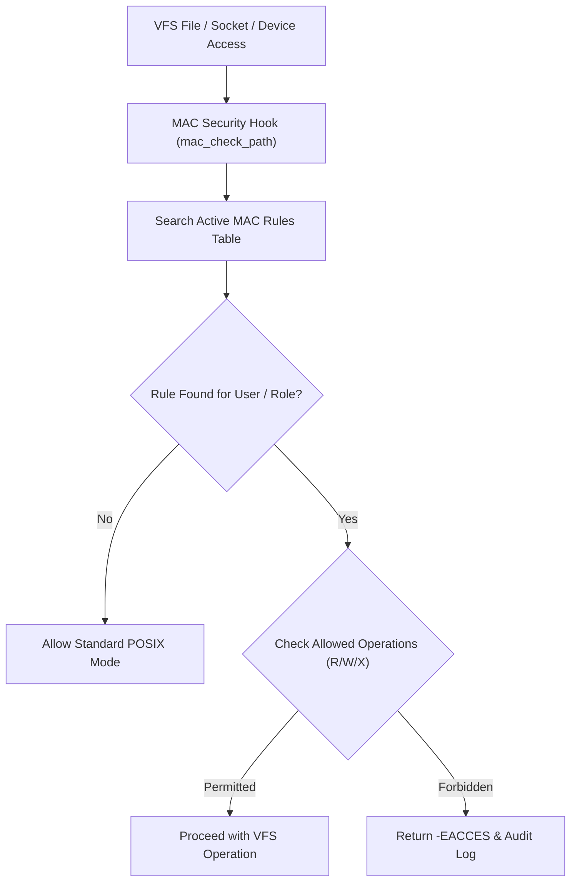

<!-- SPDX-License-Identifier: GPL-2.0-only -->

# Mandatory Access Control (MAC) & Inode Security

This document specifies the Mandatory Access Control (MAC) subsystem, rule enforcement engine, capability validation, and inode-level security policies in Keira Kernel.

---

## MAC Enforcement Architecture



---

## Technical Specifications

| Parameter | Specification | Description |
| :--- | :--- | :--- |
| **Enforcement Granularity** | Path Prefix & Inode Label | Path-based access control rules (e.g. `/system/`, `/config/`) |
| **Max Rules** | 64 active MAC rules | In-memory statically bounded policy table |
| **Operation Mask** | `MAC_READ`, `MAC_WRITE`, `MAC_EXEC` | Bitmask defining allowed access modes |
| **Audit Logging** | Kernel syslog daemon (`syslogd`) | Violations automatically appended to `/data/log/syslog.log` |

---

## Core API (`crates/crypto/src/mac/mod.rs`)

```rust
pub const MAC_READ: u8 = 0x01;
pub const MAC_WRITE: u8 = 0x02;
pub const MAC_EXEC: u8 = 0x04;

/// Check if active user context has permission to access a path under MAC rules.
pub unsafe fn check_access(path: &str, requested_flags: u8) -> Result<(), &'static str>;

/// Register a new Mandatory Access Control rule.
pub unsafe fn add_rule(
    path_prefix: &str,
    role_id: u32,
    allowed_ops: u8,
) -> Result<(), &'static str>;
```
