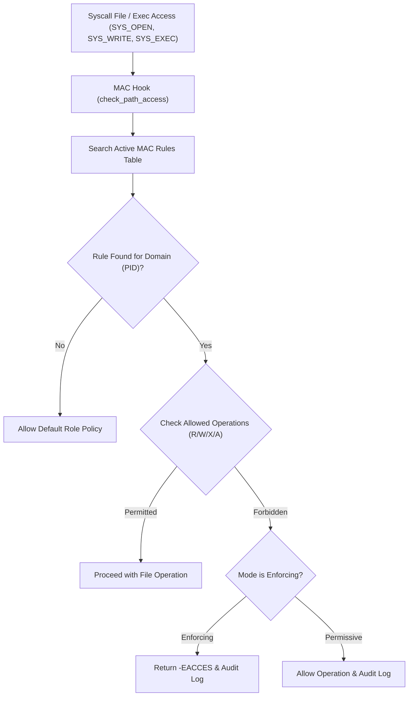

<!-- SPDX-License-Identifier: GPL-2.0-only -->

# Mandatory Access Control (MAC) & Type Enforcement

This document specifies the Mandatory Access Control (MAC) subsystem, Type Enforcement security domains, rule matrix, and security audit event logging in Keira Kernel.

---

## MAC Enforcement Architecture



---

## Technical Specifications

| Parameter | Specification | Description |
| :--- | :--- | :--- |
| **Security Domains** | Kernel, System, User, Guest, Network | Role/domain separation based on task context |
| **Enforcement Modes** | Enforcing, Permissive, Disabled | Toggle dynamic policy strictness |
| **Rule Matrix** | 16 active policy rules | In-memory statically bounded policy table |
| **Permission Bits** | `MAC_READ`, `MAC_WRITE`, `MAC_EXEC`, `MAC_APPEND` | Bitmask defining allowed access modes |
| **Audit Buffer** | 16-slot event ring log | Violations tracked with PID, domain, path, and decision |

---

## Core API (`crates/task/src/security/mac.rs`)

```rust
#[derive(Debug, Copy, Clone, PartialEq, Eq)]
pub enum MacDomain {
    Kernel,
    System,
    User,
    Guest,
    Network,
}

#[derive(Debug, Copy, Clone, PartialEq, Eq)]
pub enum MacMode {
    Disabled,
    Permissive,
    Enforcing,
}

/// Check Mandatory Access Control permissions for target file path operation.
pub fn check_path_access(pid: u64, path: &str, mask: u32) -> bool;

/// Set active MAC operational mode.
pub fn set_mode(mode: MacMode);

/// Get active MAC operational mode.
pub fn get_mode() -> MacMode;

/// Retrieve active Type Enforcement rules table.
pub fn get_rules() -> [MacRule; MAX_MAC_RULES];

/// Retrieve security audit event log buffer.
pub fn get_audit_log() -> [Option<MacAuditEvent>; MAC_AUDIT_LOG_CAPACITY];

/// Retrieve telemetry statistics (total_checks, total_violations).
pub fn get_stats() -> (u64, u64);
```
