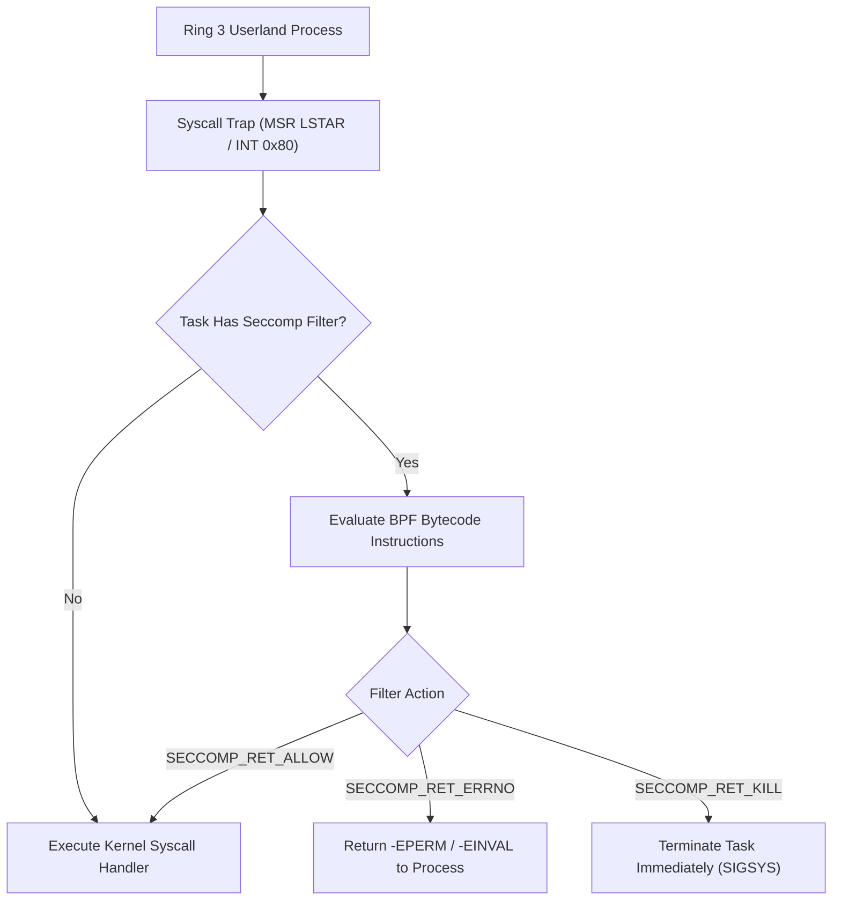

<!-- SPDX-License-Identifier: GPL-2.0-only -->

# Seccomp BPF System Call Filtering

This document details task-level Berkeley Packet Filter (BPF) system call sandboxing, enforcement modes, and security isolation in Keira Kernel.

---

## Seccomp Filtering Architecture



---

## Technical Specifications

| Parameter | Specification | Description |
| :--- | :--- | :--- |
| **Filter VM** | Classic BPF (cBPF) | 32-bit register accumulator and scratch memory |
| **Max Instructions** | 256 instructions per filter | Memory-bounded execution without loops |
| **Evaluation Context** | `SeccompData` structure | System call number, architecture tag, 6 arguments |
| **Inheritance Policy** | Process Clone / Fork | Child tasks automatically inherit parent security filters |

---

## Core API (`crates/crypto/src/seccomp/mod.rs`)

```rust
pub const SECCOMP_RET_KILL: u32 = 0x0000_0000;
pub const SECCOMP_RET_ERRNO: u32 = 0x0005_0000;
pub const SECCOMP_RET_ALLOW: u32 = 0x7FFF_0000;

/// Evaluate installed Seccomp BPF program for a given system call invocation.
pub unsafe fn eval_seccomp_filter(
    task_id: u32,
    syscall_nr: u64,
    args: &[u64; 6],
) -> u32;

/// Attach a new BPF program to the active thread context.
pub unsafe fn attach_filter(
    task_id: u32,
    instructions: &[BpfInstruction],
) -> Result<(), &'static str>;
```
