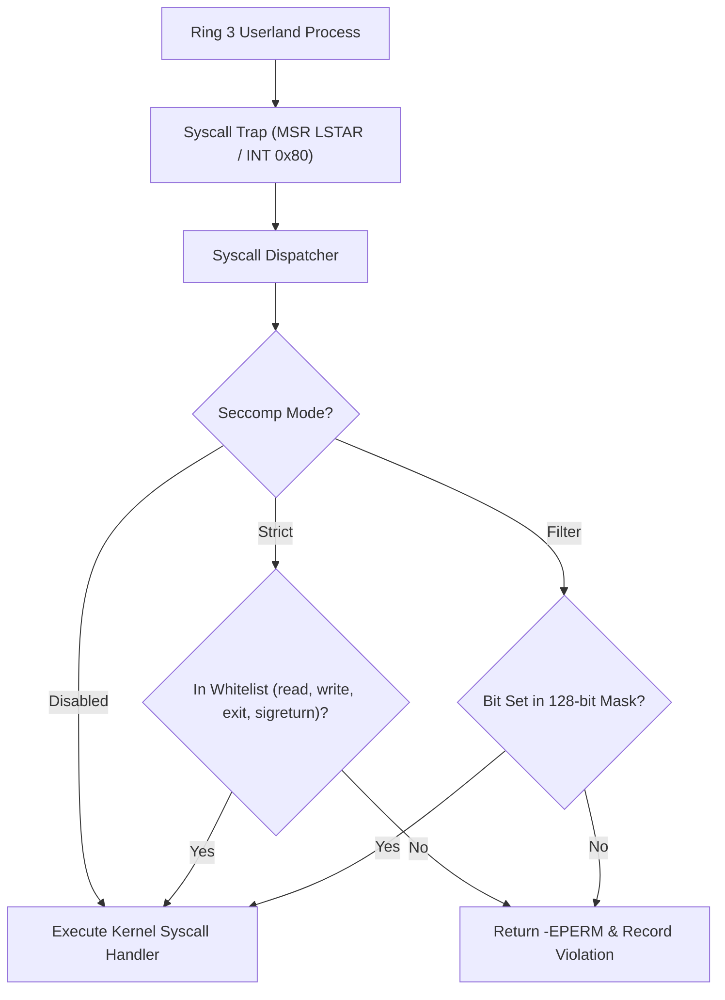

<!-- SPDX-License-Identifier: GPL-2.0-only -->

# Seccomp System Call Filtering & Sandboxing

This document details task-level system call sandboxing, strict POSIX isolation, bitmask filtering, and violation telemetry in Keira Kernel.

---

## Seccomp Filtering Architecture



---

## Technical Specifications

| Parameter | Specification | Description |
| :--- | :--- | :--- |
| **Filter Modes** | Disabled, Strict, Filter | Configurable isolation boundary |
| **Bitmask Range** | Syscalls 0..127 | 128-bit bitmask whitelist (`[u64; 2]`) |
| **Strict Mode Set** | `SYS_READ`, `SYS_WRITE`, `SYS_EXIT`, `SYS_SIGRETURN` | Minimal POSIX execution subset |
| **Enforcement Point** | `syscall_dispatcher` | Evaluated before any syscall routing |
| **Syscall Interface** | Syscall 52 (`SYS_SECCOMP`) | Userland configuration interface |

---

## Core API (`crates/task/src/security/seccomp.rs`)

```rust
#[derive(Debug, Copy, Clone, PartialEq, Eq)]
pub enum SeccompMode {
    Disabled,
    Strict,
    Filter,
}

/// Determine whether a system call is permitted under active seccomp policy.
pub fn check_syscall(syscall_num: u64) -> bool;

/// Set active seccomp operational mode.
pub fn set_mode(mode: SeccompMode);

/// Get active seccomp operational mode.
pub fn get_mode() -> SeccompMode;

/// Allow a specific system call number in filter mode.
pub fn allow_syscall(syscall_num: u64);

/// Deny a specific system call number in filter mode.
pub fn deny_syscall(syscall_num: u64);

/// Retrieve telemetry statistics (total_checked, total_violations, last_violation_syscall).
pub fn get_stats() -> (u64, u64, u64);

/// Reset seccomp configuration and counters back to baseline disabled state.
pub fn reset();
```
