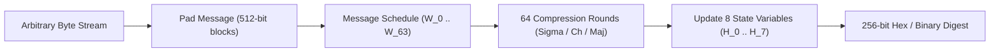

<!-- SPDX-License-Identifier: GPL-2.0-only -->

# SHA-256 Hash Function, HMAC & HKDF

This document details the pure Rust implementation of the Secure Hash Algorithm 256-bit (SHA-256), Keyed-Hash Message Authentication Code (HMAC), and HMAC-based Extract-and-Expand Key Derivation Function (HKDF) in Keira Kernel.

---

## Hash Pipeline Architecture



---

## Technical Specifications

| Parameter | Value | Description |
| :--- | :--- | :--- |
| **Digest Size** | 32 bytes (256 bits) | Cryptographic hash output length |
| **Block Size** | 64 bytes (512 bits) | Internal chunk processing size |
| **State Words** | 8 x 32-bit (`u32`) | Standard FIPS 180-4 initial constants |
| **Key Derivation** | HKDF-Extract & HKDF-Expand | RFC 5869 key derivation for TLS 1.3 |

---

## Core API (`crates/crypto/src/sha256/mod.rs`)

```rust
/// Compute standard 32-byte SHA-256 digest of an input byte slice.
pub fn sha256_digest(data: &[u8]) -> [u8; 32];

/// Compute HMAC-SHA256 over arbitrary message with secret key.
pub fn hmac_sha256(key: &[u8], message: &[u8]) -> [u8; 32];

/// HKDF-Extract: Extract a pseudorandom key (PRK) from input keying material.
pub fn hkdf_extract(salt: &[u8], ikm: &[u8]) -> [u8; 32];

/// HKDF-Expand: Expand a pseudorandom key into output keying material (OKM).
pub fn hkdf_expand(prk: &[u8], info: &[u8], okm: &mut [u8]) -> Result<(), &'static str>;
```

---

## Shell Usage

```bash
# Compute SHA-256 hash of a file on FAT16 disk
keira> sha256sum /apps/bin/kcc.elf
```
