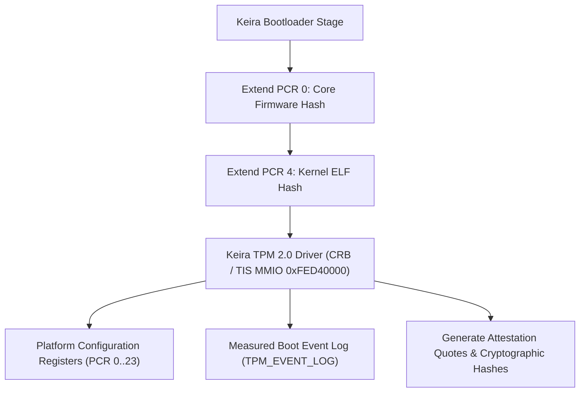

<!-- SPDX-License-Identifier: GPL-2.0-only -->

# Trusted Platform Module (TPM 2.0) Enclave

This document specifies the hardware TPM 2.0 interface, CRB/TIS memory-mapped communication, PCR measurement extensions, and hardware security token management in Keira Kernel.

---

## TPM 2.0 Security Architecture



---

## Technical Specifications

| Parameter | Specification | Description |
| :--- | :--- | :--- |
| **MMIO Base Address** | `0xFED4_0000` | Standard TIS 1.3 / CRB hardware locality 0 |
| **Supported Interface** | Command Response Buffer (CRB) / TIS | Direct memory-mapped register access |
| **PCR Bank** | SHA-256 Bank | 24 Platform Configuration Registers (256-bit) |
| **Event Log** | 16-slot ring log | Tracks firmware, bootloader, kernel, and runtime measurements |
| **Syscall Interface** | Syscall 79 (`SYS_TPM2`) | Userland / driver interaction ABI |

---

## Core API (`crates/crypto/src/tpm/tpm2.rs`)

```rust
/// Initialize TPM 2.0 controller and baseline platform measurements.
pub fn init();

/// Read current 32-byte digest of a Platform Configuration Register (PCR 0..23).
pub fn read_pcr(pcr_index: usize) -> Result<[u8; 32], &'static str>;

/// Cryptographically extend a PCR: New PCR = SHA256(Old PCR || SHA256(Data)).
pub fn extend_pcr(pcr_index: usize, data: &[u8], event_desc: &str) -> Result<[u8; 32], &'static str>;

/// Generate an attestation quote across selected PCR mask.
pub fn quote_pcrs(pcr_mask: u32) -> [u8; 32];

/// Retrieve TPM 2.0 controller status and measurement telemetry.
pub fn get_status() -> TpmStatus;
```
