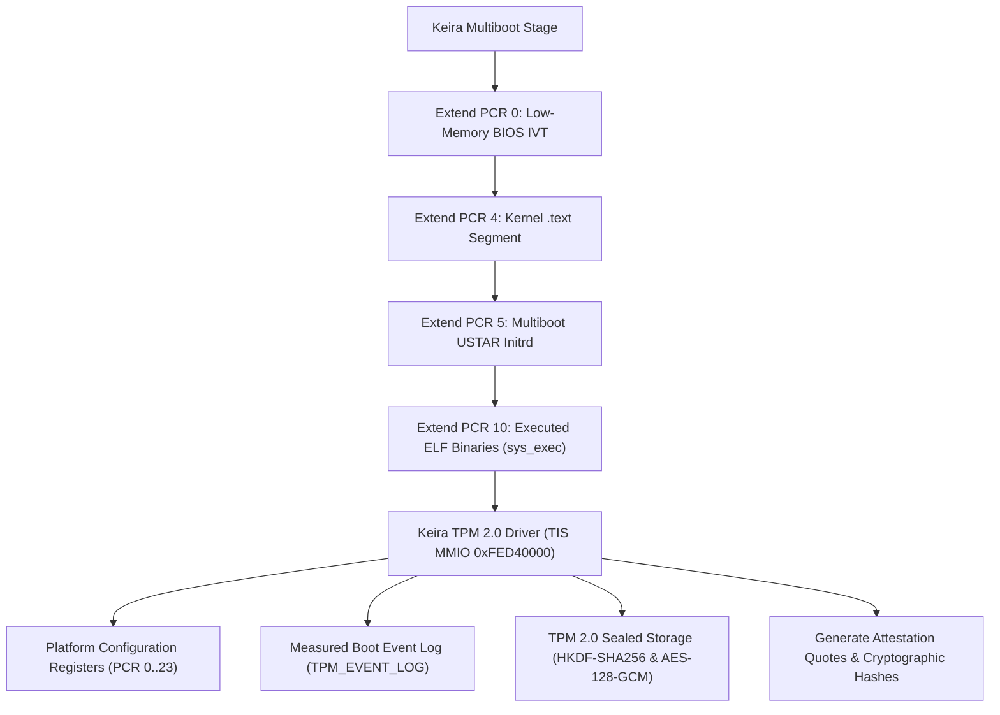

<!-- SPDX-License-Identifier: GPL-2.0-only -->

# Trusted Platform Module (TPM 2.0) Enclave

This document specifies the hardware TPM 2.0 interface, TIS memory-mapped communication, PCR measurement extensions, sealed storage, and hardware security token management in Keira Kernel.

---

## TPM 2.0 Security Architecture



---

## Technical Specifications

| Parameter | Specification | Description |
| :--- | :--- | :--- |
| **MMIO Base Address** | `0xFED4_0000` | Standard TIS 1.3 / PTP hardware locality 0 |
| **Locality Protocol** | `TPM_REG_ACCESS` | Dynamic locality acquisition (`requestUse`) and release |
| **PCR Bank** | SHA-256 Bank | 24 Platform Configuration Registers (256-bit) |
| **Event Log** | 32-slot ring log | Tracks firmware, bootloader, kernel, initrd, and runtime ELF executions |
| **Sealed Storage** | HKDF-SHA256 & AES-128-GCM | Secrets sealed cryptographically against target PCR attestation masks |
| **Syscall Interface** | Syscall 79 (`SYS_TPM2`) | Userland / driver interaction ABI (Read, Extend, Quote, Measurements, Seal, Unseal) |

---

## Core API (`crates/crypto/src/tpm/tpm2.rs`)

```rust
/// Initialize TPM 2.0 controller and baseline platform measurements.
pub fn init();

/// Read current 32-byte digest of a Platform Configuration Register (PCR 0..23).
pub fn read_pcr(pcr_index: usize) -> Result<[u8; 32], &'static str>;

/// Cryptographically extend a PCR: New PCR = SHA256(Old PCR || SHA256(Data)).
pub fn extend_pcr(pcr_index: usize, data: &[u8], event_desc: &str) -> Result<[u8; 32], &'static str>;

/// Measure genuine kernel text segment in physical RAM into PCR 4.
pub fn measure_kernel_code(code: &[u8]) -> Result<[u8; 32], &'static str>;

/// Measure Multiboot initrd ramdisk payload into PCR 5.
pub fn measure_initrd(initrd: &[u8]) -> Result<[u8; 32], &'static str>;

/// Measure userland executable binary image prior to Ring 3 execution into PCR 10.
pub fn measure_binary(binary: &[u8], name: &str) -> Result<[u8; 32], &'static str>;

/// Generate an attestation quote across selected PCR mask.
pub fn quote_pcrs(pcr_mask: u32) -> [u8; 32];

/// Seal secret data bound to a specific PCR selection policy mask.
pub fn seal_secret(secret: &[u8], pcr_mask: u32) -> Result<TpmSealedBlob, &'static str>;

/// Unseal secret data, validating PCR policy attestation quote and GMAC authentication.
pub fn unseal_secret(blob: &TpmSealedBlob, out: &mut [u8]) -> Result<usize, &'static str>;

/// Retrieve TPM 2.0 controller status and measurement telemetry.
pub fn get_status() -> TpmStatus;
```
