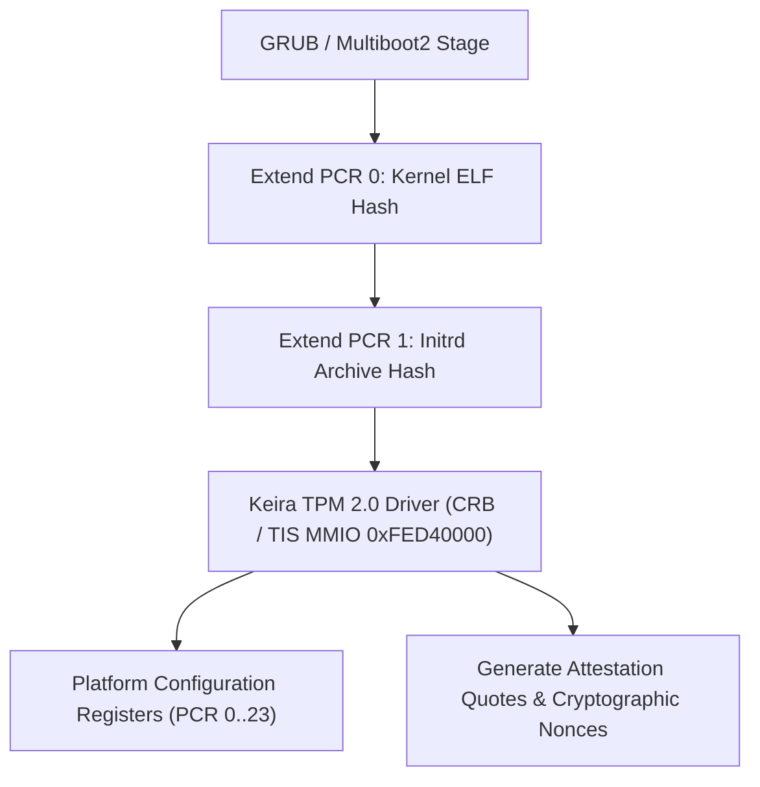

<!-- SPDX-License-Identifier: GPL-2.0-only -->

# Trusted Platform Module (TPM 2.0) Enclave

This document specifies the hardware TPM 2.0 interface, CRB/TIS memory-mapped communication, PCR measurement extensions, and hardware security token management in Keira Kernel.

---

## TPM 2.0 Security Architecture



---

## Technical Specifications

| Parameter | Specification | Description |
| :--- | :--- | :--- |
| **MMIO Base Address** | `0xFED4_0000` | Standard TIS 1.3 / CRB hardware locality 0 |
| **Supported Interface** | Command Response Buffer (CRB) / TIS | Direct memory-mapped register access |
| **PCR Bank** | SHA-256 Bank | 24 Platform Configuration Registers (256-bit) |
| **Command Protocol** | TPM 2.0 Part 3 Commands | `TPM2_CC_PCR_Extend`, `TPM2_CC_GetRandom`, `TPM2_CC_PCR_Read` |

---

## Core API (`crates/crypto/src/tpm/mod.rs`)

```rust
/// Probe and initialize hardware TPM 2.0 chip via TIS/CRB MMIO.
pub unsafe fn init() -> Result<(), &'static str>;

/// Read current 32-byte digest of a Platform Configuration Register (PCR).
pub unsafe fn pcr_read(pcr_index: u32, out_digest: &mut [u8; 32]) -> Result<(), &'static str>;

/// Extend a PCR with a new measurement digest (New PCR = SHA256(Old PCR || Data)).
pub unsafe fn pcr_extend(pcr_index: u32, measurement: &[u8; 32]) -> Result<(), &'static str>;

/// Request cryptographically secure hardware random bytes from TPM TRNG.
pub unsafe fn get_random(buf: &mut [u8]) -> Result<usize, &'static str>;
```
