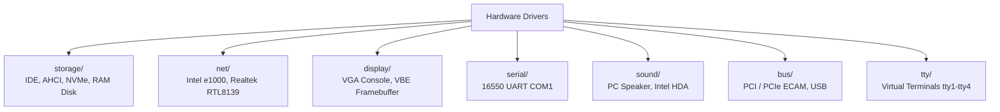

<!-- SPDX-License-Identifier: GPL-2.0-only -->

# Keira Kernel Hardware Device Drivers

The `drivers` subsystem implements native, bare-metal hardware drivers across storage controllers, network cards, video displays, serial ports, sound hardware, system busses, and virtual terminals.

---

## Driver Submodules

---

## Driver Module Index

| Submodule | Focus Area | Hardware Covered |
| :--- | :--- | :--- |
| [`storage/`](storage/README.md) | Block Storage | Legacy IDE/ATA PIO, AHCI SATA NCQ, NVMe PCIe, and RAM Disks |
| [`net/`](net/README.md) | Network Interface Cards | Intel 82540EM (e1000) Gigabit and Realtek RTL8139 Fast Ethernet |
| [`display/`](display/README.md) | Video & Consoles | 80x25 Text-Mode Console and VBE Linear Framebuffer (LFB) |
| [`serial/`](serial/README.md) | Serial Communications | 16550 UART Serial Controller (`COM1` at `0x3F8`) |
| [`sound/`](sound/README.md) | Audio Hardware | PIT Channel 2 PC Speaker and Intel High Definition Audio (HDA) |
| [`bus/`](bus/README.md) | System & Peripheral Busses | PCI Configuration Space, PCIe ECAM/MSI, and USB Host Controllers |
| [`tty/`](tty/README.md) | Terminal Subsystems | Multi-Virtual Terminals (`tty1`–`tty4`) and TTY Line Discipline |
