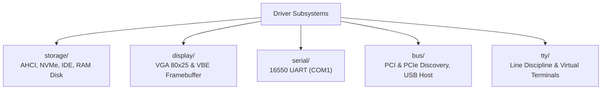

<!-- SPDX-License-Identifier: GPL-2.0-only -->

# Keira Hardware Device Drivers

The `drivers` domain contains low-level device drivers for block storage, video displays, serial ports, buses, and terminal line disciplines.

---

## Driver Submodules

---

## Submodule Index

| Submodule | Focus Area | Description |
| :--- | :--- | :--- |
| [`storage/`](storage/README.md) | Block Storage | AHCI SATA, NVMe, legacy IDE, and RAM disk drivers |
| [`display/`](display/README.md) | Video Output | VGA text mode console and linear VBE framebuffer |
| [`serial/`](serial/README.md) | Serial Ports | Standard 16550 UART COM1 serial controller |
| [`bus/`](bus/README.md) | System Buses | PCI/PCIe enumeration, USB host controller interface |
| [`tty/`](tty/README.md) | Terminals | Line discipline, canonical/raw mode, virtual terminals |
