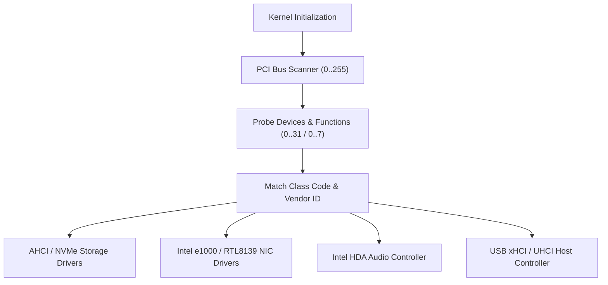

<!-- SPDX-License-Identifier: GPL-2.0-only -->

# Peripheral & System Bus Drivers

This directory details hardware bus enumeration, configuration space parsing, and device management in Keira Kernel.

---

## Bus Architecture

---

## Bus Driver Index

| Document | Bus Protocol | Description |
| :--- | :--- | :--- |
| [`pci.md`](pci.md) | PCI & PCIe ECAM | PCI configuration space access, BAR allocation, and MSI interrupts |
| [`usb.md`](usb.md) | Universal Serial Bus (USB) | UHCI/xHCI host controller interfaces and USB HID keyboard/mouse |
