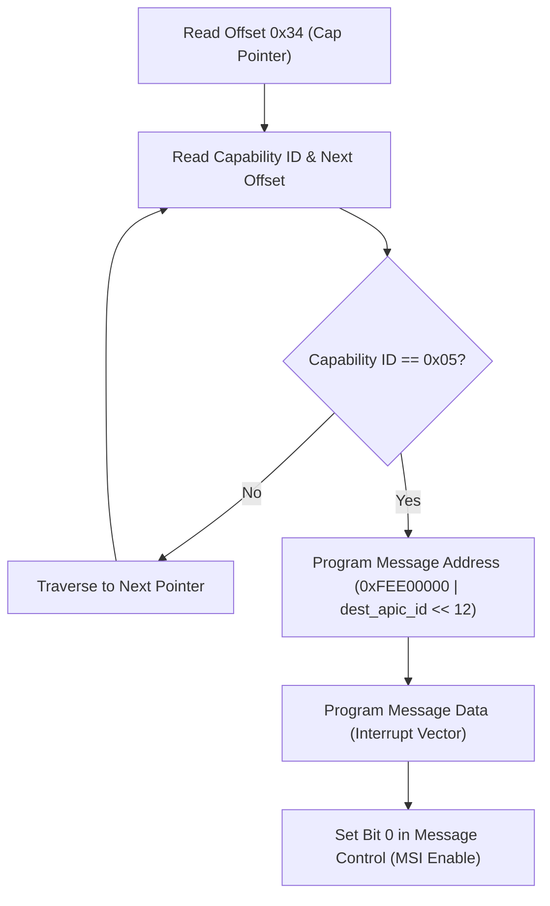

<!-- SPDX-License-Identifier: GPL-2.0-only -->

# PCI & PCIe Configuration Space Subsystem

This document specifies PCI bus scanning, Base Address Register (BAR) decoding, and MSI interrupt routing.

---

## Configuration Mechanism 1 (Port I/O)

* **CONFIG_ADDRESS**: `0xCF8` (Bus, Device, Function, Register offset).
* **CONFIG_DATA**: `0xCFC` (32-bit configuration register read/write).

---

## Core API (`crates/io/src/pci/mod.rs`)

```rust
pub struct PciDevice {
    pub bus: u8,
    pub device: u8,
    pub function: u8,
    pub vendor_id: u16,
    pub device_id: u16,
    pub class_code: u8,
    pub subclass: u8,
    pub prog_if: u8,
    pub bars: [u32; 6],
}

pub fn scan_pci_bus() -> &'static [PciDevice];
pub fn find_pci_device(vendor: u16, device: u16) -> Option<&'static PciDevice>;
```

---

## Message Signaled Interrupts (MSI) Configuration

Keira implements PCI MSI capability structure traversal and Local APIC delivery programming (`crates/io/src/bus/pcie.rs`):



### MSI Configuration Registers:
- **Capability ID**: `0x05` (8-bit ID at offset 0).
- **Next Pointer**: 8-bit offset to subsequent capability header.
- **Message Control**: 16-bit field; bit 0 enables MSI delivery, bits 1..3 define requested vector count.
- **Message Address**: 32-bit register programmed with Local APIC destination address `0xFEE00000 | (apic_id << 12)`.
- **Message Data**: 16-bit register specifying assigned interrupt vector (`0x20..0xFE`) and delivery mode.

