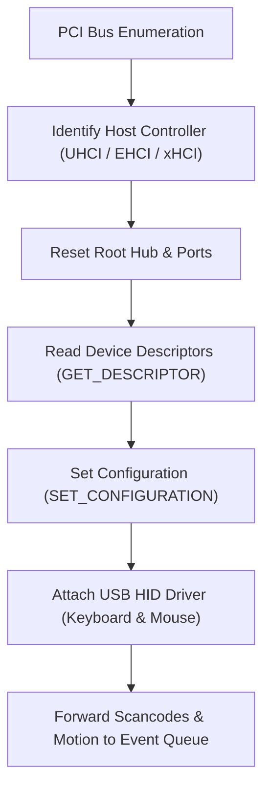

<!-- SPDX-License-Identifier: GPL-2.0-only -->

# Universal Serial Bus (USB) Subsystem

This document specifies the Universal Serial Bus (USB) host controller interface, device descriptor enumeration, and USB Human Interface Device (HID) support in Keira Kernel.

---

## USB Subsystem Architecture



---

## Technical Specifications

| Parameter | Specification | Description |
| :--- | :--- | :--- |
| **Supported Controllers** | UHCI (USB 1.1) / xHCI (USB 3.0) | Standard PCI class code `0x0C03` |
| **Supported Devices** | USB HID Keyboards, Mice, Mass Storage | Boot protocol HID fallback |
| **Transfer Modes** | Control, Interrupt, Bulk Transfers | Asynchronous transfer descriptors |
| **Descriptor Parser** | Standard USB 2.0/3.0 Descriptors | Device, Configuration, Interface, Endpoint |

---

## Core API (`crates/io/src/bus/mod.rs`)

```rust
/// Probe and initialize detected USB host controllers.
pub unsafe fn init_usb_controllers();

/// Process pending USB transfer descriptors and handle device events.
pub unsafe fn poll_usb_events();
```
