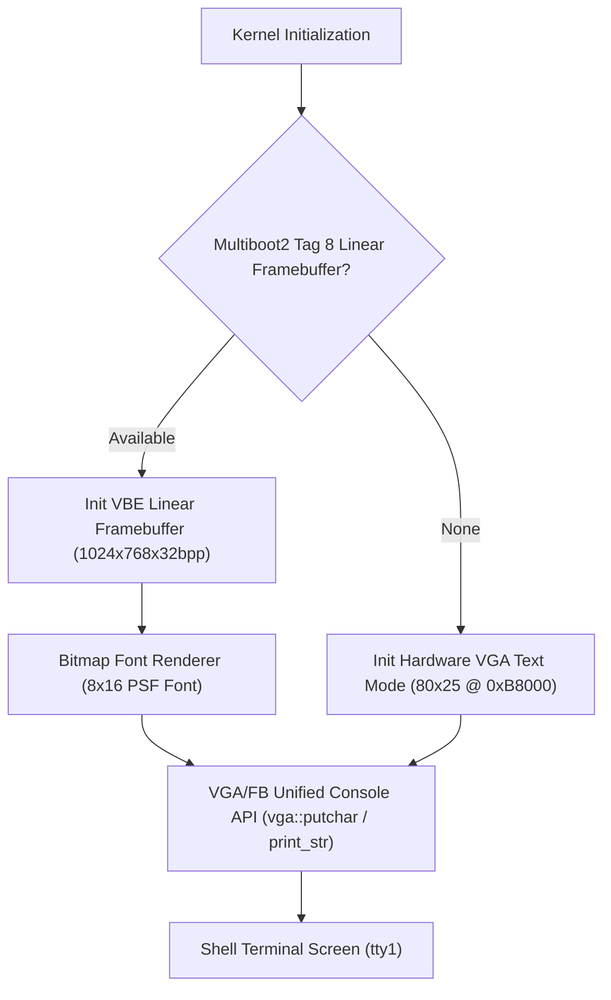

<!-- SPDX-License-Identifier: GPL-2.0-only -->

# Video & Display Drivers

This directory details video display adapters, text-mode consoles, and linear framebuffer graphics rendering in Keira Kernel.

---

## Display Subsystem Architecture

---

## Display Driver Index

| Document | Display Architecture | Description |
| :--- | :--- | :--- |
| [`vga.md`](vga.md) | VGA Text Buffer | Legacy 80x25 text-mode console mapped at physical address `0xB8000` |
| [`framebuffer.md`](framebuffer.md) | VBE Linear Framebuffer | High-resolution 32bpp ARGB framebuffer graphics and bitmap font engine |
