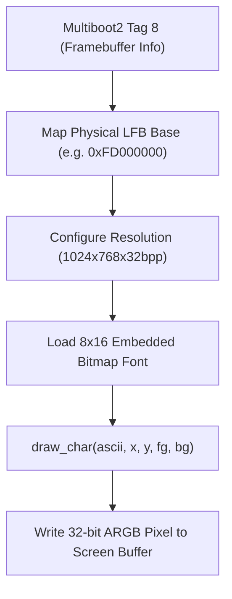

<!-- SPDX-License-Identifier: GPL-2.0-only -->

# VBE Linear Framebuffer (LFB) Graphics Driver

This document specifies the VESA BIOS Extensions (VBE) linear framebuffer graphics engine, double buffering, and bitmap font rendering in Keira Kernel.

---

## Framebuffer Rendering Pipeline



---

## Technical Specifications

| Parameter | Specification | Description |
| :--- | :--- | :--- |
| **Color Depth** | 32 bits per pixel (bpp) | `0xAARRGGBB` format |
| **Default Geometry** | 1024 x 768 pixels | 128 columns x 48 rows of text with 8x16 font |
| **Pitch (Stride)** | 4096 bytes per line | Line offset in physical video RAM |
| **Font Format** | 8x16 Bitmap PSF Font | Monospaced ASCII glyph table |

---

## Core API (`crates/io/src/vga/console.rs`)

```rust
/// Check if high-resolution VBE Linear Framebuffer mode is currently active.
pub fn fb_active() -> bool;

/// Render an 8x16 ASCII character glyph at pixel coordinates (x, y).
pub unsafe fn draw_char(c: u8, x: usize, y: usize, fg: Color, bg: Color);

/// Draw a single 32-bit ARGB pixel to the linear framebuffer.
pub unsafe fn putpixel(x: usize, y: usize, color: u32);
```
