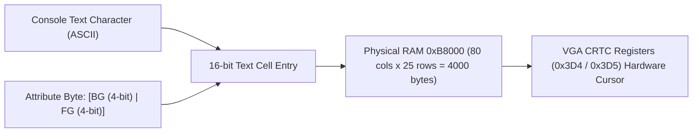

<!-- SPDX-License-Identifier: GPL-2.0-only -->

# VGA Text-Mode 80x25 Video Display Driver

This document specifies the legacy 80x25 character text-mode video adapter driver mapped at physical memory base `0xB8000` in Keira Kernel.

---

## VGA Text Buffer Architecture



---

## Technical Specifications

| Parameter | Specification | Description |
| :--- | :--- | :--- |
| **Physical Base** | `0x000B_8000` | Dual-ported VGA character buffer |
| **Grid Dimensions** | 80 columns x 25 rows | 2,000 total character cells |
| **Cell Format** | 16 bits per character | Byte 0: ASCII code, Byte 1: Attribute byte |
| **Hardware Cursor** | CRTC Ports `0x3D4` / `0x3D5` | Registers `0x0E` (Cursor High) and `0x0F` (Cursor Low) |

---

## Core API (`crates/io/src/vga/console.rs`)

```rust
/// Write a single ASCII character to the active console.
pub fn putchar(c: u8);

/// Write a string slice to the active console.
pub fn print_str(s: &str);

/// Set foreground and background colors for subsequent character writes.
pub fn set_color(fg: Color, bg: Color);

/// Clear console screen and reset cursor position to (0, 0).
pub fn clear();
```
