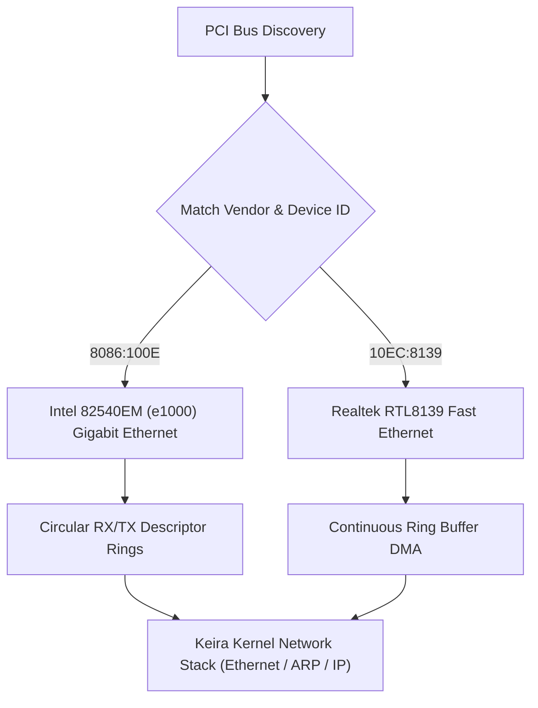

<!-- SPDX-License-Identifier: GPL-2.0-only -->

# Network Interface Card (NIC) Drivers

This directory details hardware network interface controller (NIC) drivers, ring buffer DMA descriptors, and packet transmission engines in Keira Kernel.

---

## Network Driver Architecture

---

## Network Driver Index

| Document | Hardware Adapter | Speed & Capabilities |
| :--- | :--- | :--- |
| [`e1000.md`](e1000.md) | Intel 82540EM / 82545EM | 10/100/1000 Mbps Gigabit Ethernet, circular DMA ring buffers |
| [`rtl8139.md`](rtl8139.md) | Realtek RTL8139C/D+ | 10/100 Mbps Fast Ethernet, I/O space & MMIO ring buffers |
