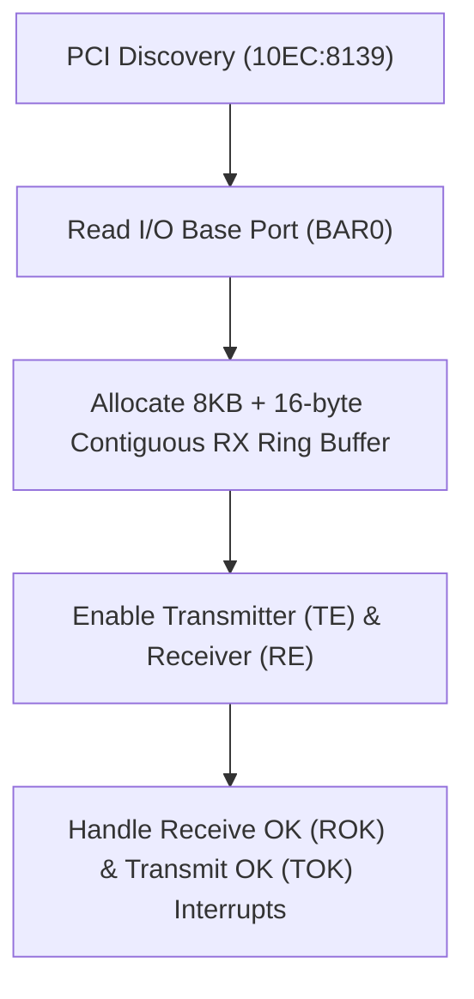

<!-- SPDX-License-Identifier: GPL-2.0-only -->

# Realtek RTL8139 Fast Ethernet Driver

This document specifies the Realtek RTL8139C/D+ 10/100 Mbps Fast Ethernet network driver, contiguous ring buffer DMA, and port I/O registers in Keira Kernel.

---

## RTL8139 Architecture



---

## Technical Specifications

| Parameter | Specification | Description |
| :--- | :--- | :--- |
| **PCI Identifiers** | Vendor `0x10EC`, Device `0x8139` | Realtek RTL8139 Fast Ethernet NIC |
| **RX Buffer Size** | 8 KB + 16 bytes + 1.5 KB wrap | Continuous circular DMA ring |
| **TX Descriptors** | 4 Transmit Descriptors | Independent start address registers (`TSD0`–`TSD3`) |
| **Command Register** | Offset `0x37` | Bit 2 (TE), Bit 3 (RE), Bit 4 (Reset) |

---

## Core API (`crates/net/src/driver/rtl8139.rs`)

```rust
/// Initialize RTL8139 network card and configure circular RX DMA.
pub unsafe fn init() -> Result<(), &'static str>;

/// Transmit raw Ethernet frame using the next available TX descriptor.
pub unsafe fn send_frame(frame: &[u8]) -> Result<(), &'static str>;

/// Read received frame from the circular ring buffer.
pub unsafe fn read_frame(buf: &mut [u8]) -> Result<usize, &'static str>;
```
