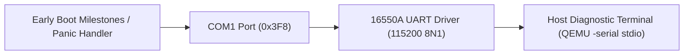

<!-- SPDX-License-Identifier: GPL-2.0-only -->

# Serial Communication Drivers

This directory specifies the serial communication drivers, 16550A UART controller interfaces, and host terminal diagnostic streams in Keira Kernel.

---

## Serial Subsystem Architecture

---

## Driver Index

| Document | Serial Hardware | Operational Role |
| :--- | :--- | :--- |
| [`uart16550.md`](uart16550.md) | 16550A UART COM1 (`0x3F8`) | ANSI-colored boot progress logging, diagnostic tracing, and panic dumps |
