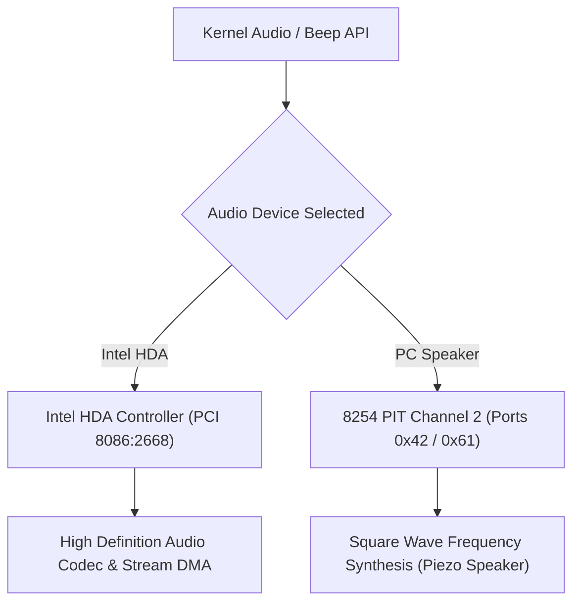

<!-- SPDX-License-Identifier: GPL-2.0-only -->

# Audio & Sound Hardware Drivers

This directory details audio synthesizer hardware, Intel High Definition Audio (HDA) codecs, and the Programmable Interval Timer (PIT) PC speaker in Keira Kernel.

---

## Sound Subsystem Architecture

---

## Sound Driver Index

| Document | Hardware Adapter | Capabilities |
| :--- | :--- | :--- |
| [`hda.md`](hda.md) | Intel High Definition Audio (HDA) | High-definition multi-channel PCM streaming and codec discovery |
| [`pc_speaker.md`](pc_speaker.md) | 8254 PIT Channel 2 PC Speaker | Square-wave tone generation and audible frequency playback |
