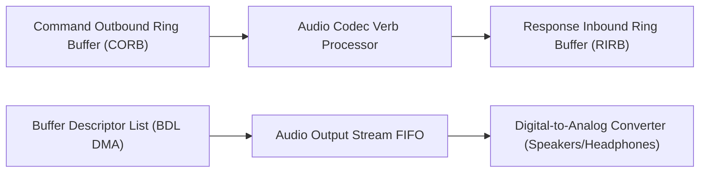

<!-- SPDX-License-Identifier: GPL-2.0-only -->

# Intel High Definition Audio (HDA) Driver

This document specifies the Intel High Definition Audio (HDA / Azalia) controller driver, Command Outbound / Response Inbound Ring Buffers (CORB/RIRB), and PCM DMA streaming in Keira Kernel.

---

## Intel HDA Architecture



---

## Technical Specifications

| Parameter | Specification | Description |
| :--- | :--- | :--- |
| **PCI Class** | `0x040300` | High Definition Audio Controller |
| **CORB/RIRB DMA** | 256-entry command ring | Asynchronous codec verb messaging |
| **Stream Engines** | Up to 16 DMA Streams | 4 Input, 4 Output, 4 Bidirectional |
| **Sample Formats** | 44.1 / 48 kHz, 16/24/32-bit PCM | High-fidelity digital audio playback |

---

## Core API (`crates/io/src/sound/mod.rs`)

```rust
/// Probe PCI bus and initialize Intel HDA controller.
pub unsafe fn init() -> Result<(), &'static str>;

/// Play a raw PCM audio stream through the primary HDA output stream engine.
pub unsafe fn play_pcm_stream(sample_rate: u32, channels: u8, pcm_data: &[u8]) -> Result<(), &'static str>;
```
