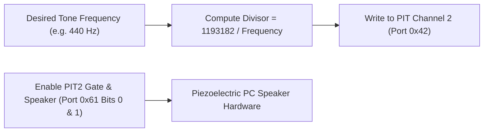

<!-- SPDX-License-Identifier: GPL-2.0-only -->

# PC Speaker & PIT Channel 2 Tone Generator

This document specifies frequency modulation on 8254 Programmable Interval Timer (PIT) Channel 2 and GPIO port `0x61` to synthesize sound on the PC speaker in Keira Kernel.

---

## PC Speaker Hardware Pipeline



---

## Technical Specifications

| Parameter | Specification | Description |
| :--- | :--- | :--- |
| **PIT Base Clock** | `1.193182 MHz` | Master timer oscillator frequency |
| **I/O Ports** | Port `0x42` (PIT Channel 2), `0x61` (PPI) | Timer counter and gate control |
| **Operating Mode** | Mode 3 (Square Wave Generator) | Continuous audible tone generation |

---

## Core API (`crates/io/src/sound/mod.rs`)

```rust
/// Play a continuous square-wave audio frequency tone on the PC speaker.
pub fn play_tone(frequency_hz: u32);

/// Mute and disable the PC speaker.
pub fn mute_speaker();

/// Play a brief audible beep for the specified duration in milliseconds.
pub fn beep(frequency_hz: u32, duration_ms: u64);
```
