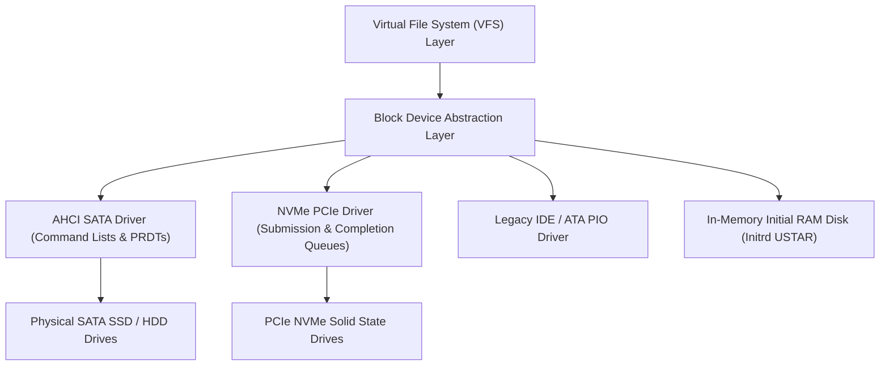

<!-- SPDX-License-Identifier: GPL-2.0-only -->

# Block Storage Controller Drivers

This directory details hardware block storage controllers, Direct Memory Access (DMA) command engines, and storage virtualization in Keira Kernel.

---

## Storage Subsystem Architecture

---

## Storage Driver Index

| Document | Storage Interface | Description |
| :--- | :--- | :--- |
| [`ahci.md`](ahci.md) | AHCI 1.3 / SATA III | Advanced Host Controller Interface with Native Command Queuing (NCQ) |
| [`nvme.md`](nvme.md) | NVMe 1.4 over PCIe | Non-Volatile Memory Express with circular submission/completion queues |
| [`ide.md`](ide.md) | ATA / IDE PIO | Legacy 16-bit PIO ATA hard disk drive controller |
| [`ramdisk.md`](ramdisk.md) | Initial RAM Disk (Initrd) | Memory-backed block device for early boot USTAR archives |
