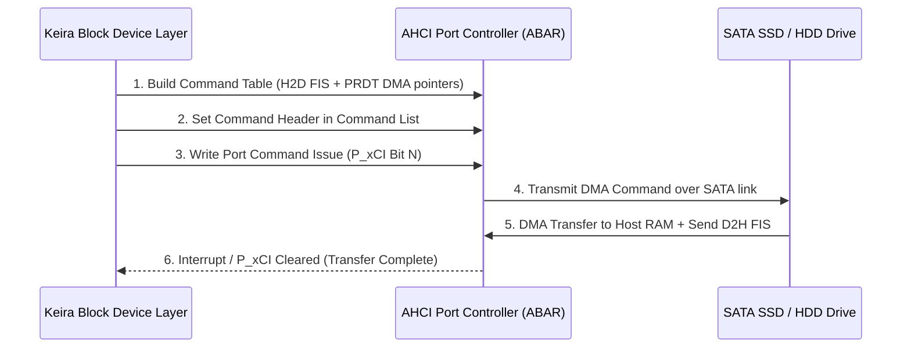

<!-- SPDX-License-Identifier: GPL-2.0-only -->

# Advanced Host Controller Interface (AHCI / SATA) Driver

This document specifies the Serial ATA (SATA) AHCI 1.3 host controller driver, Physical Region Descriptor Tables (PRDT), and FIS-based DMA command execution in Keira Kernel.

---

## AHCI Command Execution Flow



---

## Technical Specifications

| Parameter | Specification | Description |
| :--- | :--- | :--- |
| **PCI Class** | `0x010601` | Serial ATA Advanced Host Controller |
| **Ports Supported** | Up to 32 SATA Ports | Dedicated command lists and FIS structures per port |
| **DMA PRDTs** | Up to 65,535 entries per table | 4MB scatter-gather buffer chaining |
| **Addressing Mode** | LBA48 (48-bit Logical Block Addressing) | Supports drives larger than 2 Terabytes |

---

## Core API (`crates/io/src/storage/ahci.rs`)

```rust
/// Probe PCI bus for AHCI controller, map ABAR MMIO, and initialize SATA ports.
pub unsafe fn init() -> Result<(), &'static str>;

/// Read 512-byte sectors from SATA drive into kernel memory via DMA.
pub unsafe fn read_sectors(port_idx: usize, lba: u64, count: u32, buf: &mut [u8]) -> Result<(), &'static str>;

/// Write 512-byte sectors from kernel memory to SATA drive via DMA.
pub unsafe fn write_sectors(port_idx: usize, lba: u64, count: u32, buf: &[u8]) -> Result<(), &'static str>;
```
