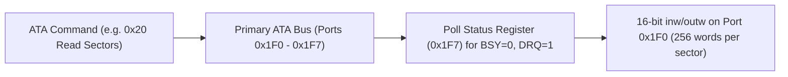

<!-- SPDX-License-Identifier: GPL-2.0-only -->

# Legacy ATA / IDE Hard Disk Drive Driver

This document specifies the legacy 16-bit Programmed Input/Output (PIO) Advanced Technology Attachment (ATA/IDE) hard disk drive controller in Keira Kernel.

---

## IDE PIO Architecture



---

## Technical Specifications

| Parameter | Specification | Description |
| :--- | :--- | :--- |
| **Primary Base Port** | `0x1F0`–`0x1F7` | Primary ATA channel data, sector, and command registers |
| **Control Port** | `0x3F6` | Device control and alternate status register |
| **Addressing Mode** | LBA28 / LBA48 | Supports 28-bit and 48-bit sector addressing |
| **Transfer Protocol** | 16-bit PIO Mode | Direct CPU I/O instructions (`inw` / `outw`) |

---

## Core API (`crates/io/src/storage/ide.rs`)

```rust
/// Read 512-byte sectors from legacy ATA hard drive via 16-bit PIO.
pub unsafe fn read_sectors(drive: u8, lba: u32, count: u8, buf: &mut [u8]) -> Result<(), &'static str>;

/// Write 512-byte sectors to legacy ATA hard drive via 16-bit PIO.
pub unsafe fn write_sectors(drive: u8, lba: u32, count: u8, buf: &[u8]) -> Result<(), &'static str>;
```
