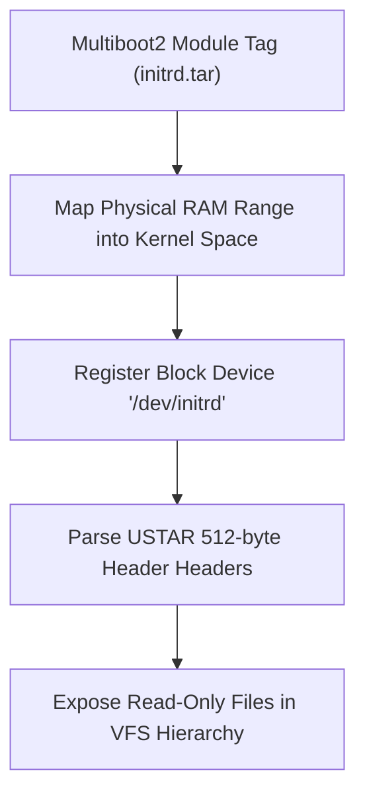

<!-- SPDX-License-Identifier: GPL-2.0-only -->

# In-Memory RAM Disk (Initrd) Driver

This document specifies the initial RAM disk (Initrd) block storage driver, memory mapping of Multiboot2 boot modules, and read-only USTAR archive decompression in Keira Kernel.

---

## RAM Disk Architecture



---

## Technical Specifications

| Parameter | Specification | Description |
| :--- | :--- | :--- |
| **Archive Format** | POSIX USTAR Tar Archive | Uncompressed 512-byte header and data records |
| **Block Size** | 512 bytes | Emulates standard block device geometry |
| **Access Latency** | Direct RAM access (`memcpy`) | Sub-microsecond seek and read operations |
| **Permissions** | Read-Only | Safe for early system initialization and recovery |

---

## Core API (`crates/io/src/storage/ramdisk.rs`)

```rust
/// Initialize RAM disk from physical memory address passed by bootloader.
pub unsafe fn init(base_addr: usize, size_bytes: usize);

/// Read 512-byte blocks from RAM disk memory.
pub fn read_blocks(lba: u64, count: u32, buf: &mut [u8]) -> Result<(), &'static str>;
```
