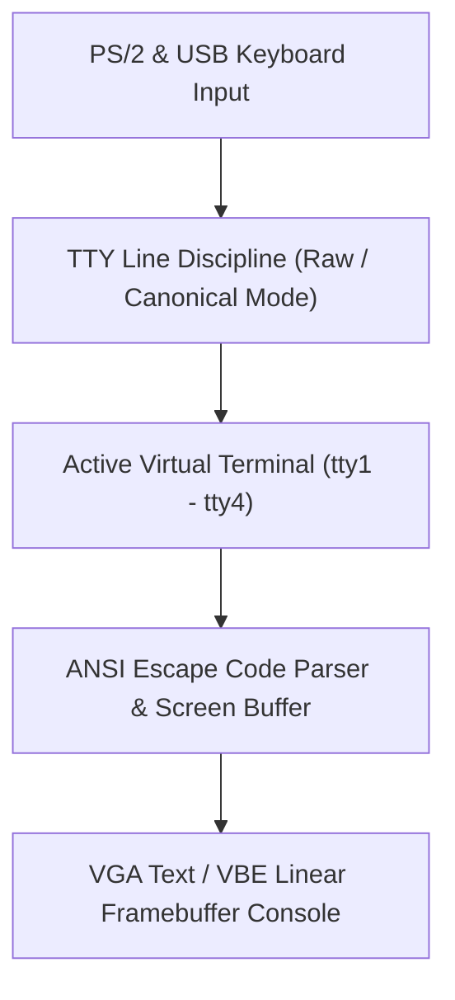

<!-- SPDX-License-Identifier: GPL-2.0-only -->

# Virtual Terminals & TTY Subsystem

This directory specifies the Virtual Terminal (VT) switching engine, ANSI terminal emulation, and TTY line discipline in Keira Kernel.

---

## TTY Subsystem Architecture

---

## TTY Module Index

| Document | Component | Description |
| :--- | :--- | :--- |
| [`virtual_terminals.md`](virtual_terminals.md) | Virtual Terminals (`tty1`–`tty4`) | Multi-session console switching via `Alt+F1`–`Alt+F4` |
| [`line_discipline.md`](line_discipline.md) | TTY Line Discipline | Character echoing, line buffering, and signal generation (`Ctrl+C`) |
