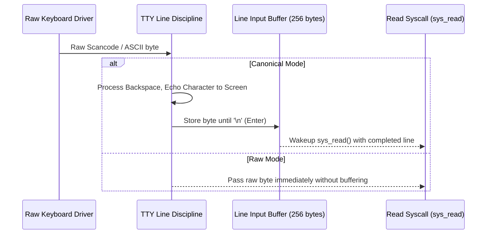

<!-- SPDX-License-Identifier: GPL-2.0-only -->

# TTY Line Discipline Subsystem

This document specifies the TTY line discipline, canonical input buffering, character echoing, and control character processing in Keira Kernel.

---

## Line Discipline Processing Flow



---

## Technical Specifications

| Mode | Behavior | Description |
| :--- | :--- | :--- |
| **Canonical Mode (`ICANON`)** | Line buffered | Input returned only after newline (`\n`); backspace enabled |
| **Raw Mode** | Character-by-character | Immediate delivery for editors (e.g. `kvi`, shell autocomplete) |
| **Echo Mode (`ECHO`)** | Automatic display | Input characters rendered directly to active screen |
| **Signal Processing (`ISIG`)** | `Ctrl+C` / `Ctrl+Z` | Translates control keystrokes into `SIGINT` / `SIGTSTP` |

---

## Core API (`crates/io/src/tty/line_discipline.rs`)

```rust
/// Push raw keyboard character into TTY line discipline.
pub unsafe fn push_char(c: u8);

/// Read cooked characters from the canonical line buffer.
pub unsafe fn read_line(buf: &mut [u8]) -> usize;
```
