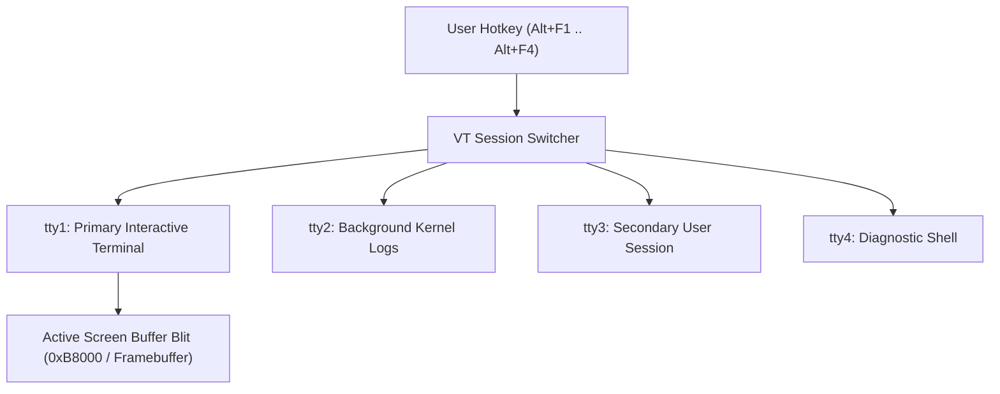

<!-- SPDX-License-Identifier: GPL-2.0-only -->

# Virtual Terminal (VT) Multi-Console Switching

This document specifies the multi-session Virtual Terminal subsystem, independent screen buffers, and hotkey switching in Keira Kernel.

---

## Virtual Terminal Architecture



---

## Technical Specifications

| Parameter | Specification | Description |
| :--- | :--- | :--- |
| **Terminal Count** | 4 Virtual Terminals (`tty1`–`tty4`) | Independent session state, cursor, and scrollback |
| **Hotkeys** | `Alt+F1`, `Alt+F2`, `Alt+F3`, `Alt+F4` | Instant hardware console switching |
| **Buffer Size** | 4,000 bytes per VT (80x25) | Text-mode matrix storage |
| **Cursor Position** | Independent $(X, Y)$ coordinates | Preserved across terminal switches |

---

## Core API (`crates/io/src/tty/mod.rs`)

```rust
/// Switch active screen display to specified virtual terminal index (0..3).
pub unsafe fn switch_vt(vt_index: usize);

/// Write character to the active virtual terminal buffer.
pub unsafe fn vt_putchar(vt_index: usize, c: u8);
```
